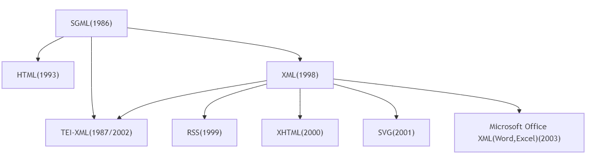
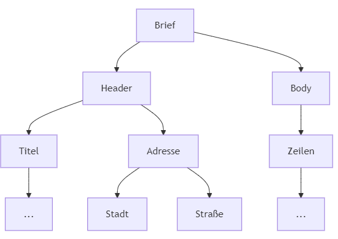

<!--

author: Moritz Riemann, Gregor Große-Bölting
email:  ggb@informatik.uni-kiel.de
version: 0.1
language: en
narrator: UK English Female


-->

# Philosophinnen im Exil III 

**OLAT-Kurs:** https://lms.uni-kiel.de/auth/RepositoryEntry/5612109826/CourseNode/111322663929783

**Dozierende:**

* Moritz Riemann (riemann@philsem.uni-kiel.de)
* Gregor Große-Bölting (ggb@informatik.uni-kiel.de)

**Zeit und Raum:** Di 16:15 - 17:45, CAP4 - R.13.1304a


**Thema:**

Nach wie vor finden Philosophinnen in der akademischen Philosophie zu wenig Beachtung. Dies ist auch darauf zurückzuführen, dass viele Philosophinnen des 20. Jahrhunderts unmittelbar von Vertreibung und Verfolgung durch den Nationalsozialismus betroffen waren: Während wenige, wie Hannah Arendt oder Edith Stein, trotz dessen internationale Berühmtheit erlangen konnten, werden einige, wie Judith N. Shklar, erst in den letzten Jahren wiederentdeckt; andere sind fast vergessen (z.B. Margarete Susman, Maria Moll, Gertrud Kantorowicz) oder werden kaum als eigenständige Philosophinnen wahrgenommen (z.B. Lotte Labowsky, Gretel Adorno, Gertrud Bing).

In dieser Seminarreihe begeben wir uns interdisziplinär und mit Methoden der digitalen Geisteswissenschaften auf die Suche nach vergessenen Denkerinnen.
Das Seminar ist teil eines zweijährigen Lehrprojektes schließt an die Veranstaltungen der vergangenen Semester an. Ein Neueinstieg ist jederzeit möglich und sinnvoll. 

**Inhalte und Vorgehen:**

* Interdisziplinäres Arbeiten: Philosophie- und Informatik-studierende arbeiten zusammen und gewinnen Einblick in das andere Fach
* Einblick in die Digital Humanities und grundlegendes Verständnis digitaler Methoden geisteswissenschaftlicher Arbeit
* Arbeit mit X-Technologien, wie XML TEI, ODD, XSLT und RDF
* Praktische Fähigkeiten im Umgang mit Forschungsdaten und im kollaborativen Arbeiten
* Digitale Analyse- und Visualisierungsmethoden für geistes-wissenschaftliche Fragestellungen
* Erforschung angemessener Formen interdisziplinär-digitaler Wissenschaft und Universität
* Reflexion der eigenen Fachkultur und der Methoden der Informatik bzw. Digital Humanities

## Organisatorisches

### Regierungserklärung

1. Diese Veranstaltung ist eine Forschungs**werkstatt**: Wir setzen neue Methoden und Software ein. Seid also nachsichtig mit uns und mit euch selbst, wenn mal etwas nicht funktioniert wie geplant. Lasst uns zeitnah wissen, wenn ihr Probleme habt, dann findet sich für alles eine Lösung!
2. Das Seminar wird sich voraussichtlich für Philosophiestudierende nicht wie eine Philosophieveranstaltung und für Informatikstudierende nicht wie eine Informatikveranstaltung anfühlen.
3. Ihr dürft (und sollt) gerne eigene Tools und Ideen einbringen! Der Seminarplan ist auch offen für Eure Vorschläge.
4. Interdisziplinarität lebt von wechselseitiger Verständlichkeit: Redet mit uns und mit Euren Mitstudierenden, wenn ihr Dinge nicht versteht oder Hilfe braucht.
5. Wir erwarten von euch, dass ihr euch zwischen den Sitzungen mit den Seminarinhalten befasst (Texte lest, Aufgaben erledigt) und zu den Präsenzsitzungen anwesend seid. Im Gegenzug unterstützen wir euch, wo wir können und machen Zugeständnisse, falls die Arbeitsbelastung zu groß werden sollte. 
6. Der Seminarplan ist "im Fluss".

### Semesterplan

| Datum | Thema/Inhalt | Protokoll |
|-------|--------------| --------- |
| 15.04. | Begrüßung, Einführung in das Thema, Überblick über das Semester | - | 
| 22.04. | **I. Philosophiegeschichte.** Judith N. Shklar "Exil, Loyalität, Verpflichtung" | Mika |
| 29.04. | Universität und Philosophie in Deutschland 1920/1930 | Senanur |
| 06.05. | (Digitales Edieren) Daten, Datenmodelle und -typen, Autoritäten und Vokabulare  | Peer |
| 13.05. | (REFERAT) Sozialgeschichte der Philosophie (bspw. Bourdieu)  | Ahad  |
| 20.05. | **II. Digitales Edieren.** Einführung in XML und Annotieren mit TEI XML; Transkribieren von Hand | Michel |
| 27.05. | (REFERAT) Der "Warburg-Kreis": Aby Warburg, Ernst Cassirer, Lotte Labowsky, Getrud Bing | Rimsha  |
| 03.06. | OCR, (semi-)automatische Transkription m. Transkribus und Tesseract; Beispiele und Entwicklung von Forschungsfragen | Levan  |
| 10.06. | Auswertungs- und Visualisierungsmöglichkeiten: zeitliche Verläufe, Geo-Daten (GIS), Netzwerkanalysen | Max |
| 17.06. | **III. Praxisteil / Projektphase.** Recherchemethoden und Quellen | Robert  |
| 24.06. | (REFERAT) FAIR-Prinzipien und Forschungsdatenmanagment |   |
| 01.07. | (REFERAT) Arbeitssitzung |   |
| 08.07. | *Doppelsitzung:* Abschlusspräsentation | - |

### Forschungs(daten)zyklus


#### ScanTent


#### Transkribus


#### TEI XML: Datenannotation


#### Analyse: Netzwerke, Zeitverläufe, GIS


### Prüfungsleistung

**Für Informatiker_innen:**

* "Sitzungsprotokoll" (15%)
* Peer Review (15%)
* Poster und Posterpräsentation (30%)
* Ausarbeitung (40%)

Alle Teilleistungen müssen für eine erfolgreiche Gesamtteilnahme eingereicht und bestanden werden. 

**Für Philosoph_innen:**

Jede der Prüfungsformen beinhaltet die gemeinsame Präsentation in einer Kleingruppe am Ende des Semesters.

* Referate: bitte frühzeitig melden!
* Podcast (nur für BA7 und BA8)
* Essay
* Hausarbeit

---

Mögliche Referats- und Podcastthemen:

* Sozialgeschichte der Philosophie
* Warburg-Kreis
* Cassirer 
* Porträt: Labowsky, Bing, Klibansky / Verhältnis von Philosophie und Philologie 
* ... sprecht uns an!

#### Hinweise zum "Poster" (für alle)

**Aufgabenstellung:** tba

Das Poster wird in der letzten (Doppel-)Sitzung **am 08. Juli 2025** vorgestellt. Dafür stehen jeder Kleingruppe 10 Minuten zur Verfügung ihre Ergebnisse zu präsentieren. Das Zeitlimit ist strikt.

#### Hinweise zu Podcasts (für Philosoph_innen)

Umfangreiche Hinweise zur Erstellung von Podcasts als Prüfungsleistung findet ihr im [folgenden Leitfaden](https://liascript.github.io/course/?https://raw.githubusercontent.com/mauriemann/Podcast/main/Podcast_main.md).

#### Hinweise zum "Sitzungsprotokoll" (für Informatiker_innen)

**Aufgabenstellung:** Sprecht mit Gregor eine Sitzung ab, für die ihr ein "Sitzungsprotokoll" anfertigt. Das Protokoll soll die wichtigsten Ergebnisse und Erkenntnisse der Sitzung festhalten (nicht den Verlauf) und dient als Ergänzung bzw. Erweiterung des Kursmaterials, sprich: Die "Protokolle" werden direkt in das Material übernommen und dienen als gemeinsame Ressource für alle zur Nachbereitung des Seminars. Entsprechend sollte das Protokoll so aufbereitet sein, dass ein Nicht-Anwesender Studierender sich anhand der Notizen im Nachhinein ein klares Bild davon machen kann, welche Inhalte in der entsprechenden Woche besprochen wurden. 

Das Protokoll muss bis **spätestens zwei Wochen** nach der Sitzung per E-Mail (ggb@informatik.uni-kiel.de) oder [pull request](https://github.com/DH-Lehre/2025SoSe_Seminar-Philosophinnen-im-Exil-III) bei mir eingereicht werden.

Weitere Formalia:

* min. 500 Wörter (etwa eine DIN A4-Seite)
* Das Dokument ist in Markdown abgefasst (noch besser: es verwendet die [LiaScript-Syntax](https://liascript.github.io/course/?https://raw.githubusercontent.com/liaScript/docs/master/README.md#1))
* Falls externe Quellen oder Literatur verwendet wurden, müssen diese gemäß eines üblichen Zitationsstandards (APA, IEEE, ACM, etc.) angegeben werden (bevorzugt: APA)
* Falls ChatGPT o. ä. verwendet wurden: Umfang und Prompts angeben 

Für eine ausreichende (oder bessere) Arbeit

* Besitzt der eingereichte Text eine klare Struktur, die durch Markdown kenntlich gemacht wird
* Wurde eine Rechtschreib- und Grammatikprüfung durchgeführt
* Werden die wichtigsten Themen, Begriffe, etc. der Woche aufgeführt

Eine gute (oder bessere) Arbeit

* Ist verständlich geschrieben und besitzt einen deutlichen, roten Faden
* Bezieht die fachliche Expertise Mitstudierender aus der Philosophie mit ein 
* Nennt und verarbeitet Quellen, die über die Seminarliteratur hinausgehen
* Integriert sich nahtlos in das existierende LiaScript-Material für die Sitzung

Das LiaScript-Material findet ihr in diesem GitHub-Repository: https://github.com/DH-Lehre/2025SoSe_Seminar-Philosophinnen-im-Exil-III

Um das Material zu erweitern, könnt ihr das Repo forken und entsprechend [dieses Workflows](https://github.com/DH-Lehre/2025SoSe_Seminar-Philosophinnen-im-Exil-III) eine Pull Request stellen.

#### Hinweise zur Peer Review (für Informatiker_innen)

**Aufgabenstellung:** Euch wird am Tag der Posterpräsentation eine andere Gruppe zugewiesen. Schreibt eine kurze "Kritik" des vorgestellten Posters. Diese Kritik sollte in der Tendenz positiv, wertschätzend und konstruktiv sein, d.h. Möglichkeiten der Verbesserung aufzeigen. Versucht dafür nachvollziehbare Kriterien der Bewertung zu finden. Berücksichtigt sowohl den Vortrag, wie auch das erstellte "Poster". Die Peer Review sollte die Möglichkeit bieten die kritisierten Punkte in der Ausarbeitung zu berücksichtigen.

Das Protokoll ist **bis spätestens zum 31. Juli 2025** per E-Mail (ggb@informatik.uni-kiel.de) bei mir als PDF einzureichen.

Weitere Formalia:

* 300 Wörter (+/- 20%), etwas weniger als eine DIN A4-Seite. Bitte gebt die Anzahl der Wörter am Ende des Dokuments an.
* Name, stu-Mailadresse
* Unterschriebene Eigenständigkeitserklärung
* Falls externe Quellen oder Literatur verwendet wurden, müssen diese gemäß eines üblichen Zitationsstandards (APA, IEEE, ACM, etc.) angegeben werden
* Falls ChatGPT o. ä. verwendet wurden: Umfang und Prompts angeben (ich rate von der Verwendung ab, da es sich um eine Reflexion der eigenen Erfahrungen mit dem Tool handeln soll)

Für eine ausreichende (oder bessere) Arbeit

* Besitzt der eingereichte Text eine klare Struktur
* Wurde eine Rechtschreib- und Grammatikprüfung durchgeführt
* Der Text wertschätzend und konstruktiv verfasst
* Ein "problematischer" Aspekt der Posterpräsentation identifziert

Eine gute (oder bessere) Arbeit

* Ist verständlich geschrieben und besitzt einen deutlichen, roten Faden
* Mehrere verbesserungswürdie Aspekte der Posterpräsentation identiziert
* Lösungsmöglichkeiten für die Aspekte benannt

#### Hinweise zur Ausarbeitung (für Informatiker_innen)

**Aufgabenstellung:** tba

Die Ausarbeitung sollte eine Einleitung mit Motivation, eine Darstellung des Hintergrunds und Forschungskontexts, eine Vorstellung und Begründung der Methodik, die Ergebnisse und Diskussion eurer Untersuchung, sowie einen kurzen Abschluss und Ausblick beinhalten. Eure Untersuchung und Ausarbeitung dürfen alle Materialien, die ihr im Laufe des Semesters erarbeitet hat, benutzen. Ihr könnt bspw. eure Zwischen- oder Abschlusspräsentation als Grundlage verwenden. 

Sprecht bis zum **31. Juli 2025** ein Thema mit mir (Gregor) per E-Mail, Mattermost oder in einer Sprechstunde (Termin auf Anfrage) ab.

Die Ausarbeitung muss bis zum **30. September 2025** (Ende des Semesters) per E-Mail (ggb@informatik.uni-kiel.de) bei mir als PDF eingereicht werden.

Weitere Formalia:

* 1500 Wörter im einspaltigen [ACM-Template](https://www.acm.org/publications/proceedings-template), bevorzugt in LaTeX ([Overleaf](https://www.rz.uni-kiel.de/de/angebote/software/overleaf/overleaf))
* Name, stu-Mailadresse
* Unterschriebene Eigenständigkeitserklärung
* Externe Quellen sind gemäß der ACM-Zitierweise anzugeben; das Literaturverzeichnis zählt nicht zur Gesamtlänge
* Falls ChatGPT o. ä. verwendet wurden: Umfang und Prompts angeben (zählt nicht zur Gesamtlänge)
* Die Arbeit kann auf Deutsch oder Englisch verfasst werden

Für eine ausreichende (oder bessere) Arbeit

* Besitzt der eingereichte Text eine klare Struktur
* Ist verständlich geschrieben und besitzt einen deutlichen, roten Faden
* Wurde eine Rechtschreib- und Grammatikprüfung durchgeführt
* Baut auf den Diskussionen und Ergebnissen des Seminars und/oder der Posterpräsentation auf
* Reflektiert das eigene Vorgehen und zeigt Vor- und Nachteile auf

Eine gute (oder bessere) Arbeit

* Leistet einen Beitrag, der erkennbar über die Ergebnisse des Seminars und/oder der Posterpräsentation hinausgeht
* Bezieht Literatur ein, die über das hinausgeht, was im Seminar erwähnt/verwendet wurde
* Zeigt ein hohes und kritisches Verständnis der vewendeten Methoden
* Reflektiert den informatischen und philosophischen (natürlich weniger umfangreich) Beitrag für die Digital Humanities


## Sitzung am 15.04. 

### "Speed Dating"

Sprecht mit der Person, die euch gegenübersitzt, zwei Minuten über die folgenden Fragen:

1. Warum studiert Ihr Eure Disziplin?
2. Was bewundert Ihr an der jeweils anderen Disziplin?
3. Welche einflussreichen Frauen (Philosophinnen, Informatikerinnen) kennt ihr in eurer Disziplin?

Wenn das Signal gegeben wird, rücken diejenigen, die mit dem Rücken zum Eingang/Front sitzen, einen Platz nach links.

Diejenigen die außen sitzen wechseln die Reihe und füllen den leeren Platz in der nächsten Reihe auf usw.

### Wie liest man philosophische Texte?

Philosophische Texte sollten bzw. können nicht wie andere Texte gelesen werden: Sie müssen eingeordnet und verstanden werden, das Textverständnis erfordert eine aktive Auseinandersetzung. Rosenberg (1984) macht sechs verschiedene Vorschläge, wie man eine:n Philosoph:in lesen kann:

>1. Sie können einen Philosophen auf seine Resultate hin lesen 
>2. Sie können einen Philosophen auf seine Argumente hin lesen 
>3. Sie können einen Philosophen in seinem dialektischen Zusammenhang lesen 
>4. Sie können einen Philosophen kritisch lesen
>5. Sie können einen Philosophen auf die Entscheidung eines Problems hin lesen
>6. Sie können einen Philosophen kreativ lesen 
>
> (Rosenberg, 1984)

Der vollständige Text mit einer Erläuterung, was es mit den einzelnen Thesen auf sich hat, findet sich im [OLAT-Materialverzeichnis](https://lms.uni-kiel.de/url/RepositoryEntry/5455183961/CourseNode/109271451133388/path%3D~~Texte~~Jay%20F%2E%20Rosenberg%5F%20Sechs%20Moglichkeiten%5F%20einen%20Text%20zu%20lesen%2Epdf/0). 

### Zur nächsten Sitzung

Lest zur folgenden Sitzung (im OLAT Materialverzeichnis zu finden):

* Shklar, J. N. (2019). *Verpflichtung, Loyalität, Exil* (H. Bajohr, Ed.; No. 130; Erste Auflage). Matthes & Seitz Berlin.

Lest den Text aufmerksam auf folgende Fragen hin:

1. Warum spricht Shklar von Exil und nicht von Flucht oder Migration?
2. In welchem Verhältnis stehen Verpflichtung und Loyalität zueinander? Was bedeuten die Begriffe bei Shklar?
3. Was hat es mit dem Verrat eines Staats an seinen Bürger:innen auf sich?
4. Warum muss Loyalität gebändigt werden und was ist Shklars Lösung dafür?

## Sitzung am 22.04.

Themen der Sitzung : 

1. Lebenslauf Judith Nisse Shklar
2. Philosophisches Denken/Form des Liberalismus
3. Verpflichtung, Loyalität und Exil Definitionen

### Lebenslauf: Judith Nisse Shklar


**Name:** Judith Nisse Shklar  

**Geboren:** 24. September 1928 in Riga, Lettland 

**Gestorben:** 17. September 1992 in Cambridge, Massachusetts, USA  

**Beruf:** Politikwissenschaftlerin und politische Theoretikerin  

Judith Nisse Shklar wurde 1928 in Riga geboren und entstammte einer wohlhabenden jüdischen Familie. Aufgrund der 1939 mit dem Hitler-Stalin-Pakt eingehenden Bedrohung floh sie über Schweden und die Sowjetunion nach Japan und schließlich in die USA. Da sie zum Zeitpunkt ihrer Flucht noch keine akademische Arbeit betrieb, gilt sie nicht als exilierte Philosophin. Nachdem sie zunächst wegen eines fehlenden Visums in Internierungshaft genommen wurde, erhielt sie 1941 zusammen mit ihrer Familie ein Aufenthaltsvisum und reiste weiter nach Montreal, Kanada. Dort begann Shklar ihre akademische Laufbahn, machte 1944 ihren Schulabschluss und studierte im Anschluss 1945 politische Theorie an der McGill University. 1955 promovierte sie an der Harvard University mit ihrer Arbeit "After Utopia" und wurde 1957 als erste Frau der politischen Theorie Assistenzprofessorin in Harvard. Sie lehrte bis zu ihrem Tod 1992 an verschiedenen internationalen Universitäten sowie dauerhaft in Harvard.

Judith Shklar gilt als eine der bedeutendsten liberalen Theoretikerinnen des 20. Jahrhunderts. Ihre Arbeiten haben bis heute Einfluss auf Debatten über politische Ethik, Machtbegrenzung und die Rolle von Freiheit in einer liberalen Gesellschaft.

#### Leben

**Herkunft und Flucht:** 
Geboren in eine deutschsprachige jüdische Familie, floh sie 1939 mit ihrer Familie vor den Nationalsozialisten und Sowjets über die Transsibirische Eisenbahn nach Kanada.  

**Bildung:** 
Studium der Politikwissenschaft an der McGill University in Montreal; Promotion an der Harvard University (1955). 

**Karriere:**
Erste Frau auf einer Festanstellung im Fachbereich Politische Wissenschaften an der Harvard University. Sie lehrte dort bis zu ihrem Tod und wurde 1980 zur "John Cowles Professor of Goverment" ernannt.

[**Storymap zu Shklars Flucht und Vita**](https://storymaps.arcgis.com/stories/38af7d5862a84180a00f70f34981df5b)

(Elaine Ringeloth, Fleming Jensen, SoSe 2024)

### Philosophisches Denken

Shklars 1989 veröffentlichtes Werk The Liberalism of Fear ist die Verschriftlichung ihres Grundgedankens des Liberalismus. Für sie ist Liberalismus die Idee, dass der Staat bzw. die Rechte und Gesetze in erster Linie dafür da sind, die Bürger:innen vor der Willkür und der Grausamkeit anderer zu schützen. Ihr Begriff von Freiheit knüpft an Isaiah Berlins Werk "Zwei Konzepte der Freiheit" an, in welchem er Freiheit nach positiver und negativer Freiheit unterscheidet. Während die positive Freiheit die Freiheit darstellt, etwas zu tun, zeichnet sich die negative Freiheit als die Freiheit von etwas ab, z.B. die Freiheit von Zwang oder die Freiheit von willkürlicher Gewalt. Diese negative Freiheit ist das elementare Prinzip liberaler Freiheitsrechte aus Shklars Sicht.

In ihren Werken Ordinary Vices und Faces of Injustice geht sie vertiefend auf Elemente negativer Freiheit ein. Aus dem Werk Faces of Injustice geht eine für die Deklarierung negativer Freiheit wichtige Unterscheidung zwischen Ungerechtigkeit und Unglück hervor. Während Ungerechtigkeit aus Shklars Sicht ein intentionales Handeln zum Schaden anderer ist, ist Unglück eine natürlich eintretende Katastrophe. Ihre Ausarbeitung dieser beiden Begriffe zeigt, dass eine Unterscheidung häufig kompliziert sein kann, da Unglück auch zum Teil auf politischem Handeln beruht. So ist zum Beispiel ein Verunglücken an einem Erdbeben auf den ersten Blick ein klarer Fall von Unglück. Dennoch könnte man sich auch in diesem Fall bei mangelhafter Infrastruktur auf eine Ungerechtigkeit berufen.

**Wichtige Werke**:

- *After Utopia: The Decline of Political Faith* (1957)  
- *Ordinary Vices* (*Ganz normale Laster*, 1984)  
- *The Liberalism of Fear* (*Der Liberalismus der Furcht*, 1989)  
- *Faces of Injustice* (*Über Ungerechtigkeit*, 1990)

**Der Liberalismus der Furcht (1989)**
Dieser kurze Text ist ihr bekanntester und prägendster. Es formuliert eine liberale Theorie, die darauf abzielt, Grausamkeit und Machtmissbrauch zu verhindern. Shklar argumentiert, dass der Liberalismus vor allem die Freiheit sichern sollte, ohne Furcht Entscheidungen treffen zu können. Sie befürwortet eine konstitutionelle, repräsentative und menschenrechtlich-liberale Demokratie, die Macht begrenzt und verteilt.

**Ganz normale Laster (1984)**

In diesem Buch untersucht Shklar alltägliche moralische Schwächen wie Grausamkeit, Heuchelei und Feigheit. Sie stellt Grausamkeit als das größte Übel (*summum malum*) dar und verbindet dies mit ihrer liberalen Theorie. Das Werk bietet eine tiefgehende Reflexion über die moralischen Grundlagen des politischen Handelns.

**Über Ungerechtigkeit (1990)**

In diesem Werk kritisiert Shklar die philosophische Vernachlässigung des Konzepts der Ungerechtigkeit zugunsten von Gerechtigkeitstheorien. Sie analysiert verschiedene Formen von Ungerechtigkeit (z. B. passive und aktive Ungerechtigkeit) und betont deren zentrale Bedeutung für politische und soziale Theorie.

**After Utopia: The Decline of Political Faith (1957)**

Dieses frühe Werk kritisiert utopisches Denken in der politischen Theorie und plädiert für eine realistische Betrachtung politischer Möglichkeiten. Es zeigt Shklars Skepsis gegenüber Ideologien, die auf idealisierten Zukunftsvisionen basieren.

**Essays über Hannah Arendt**

Ihre kritischen Texte über Hannah Arendt beleuchten Unterschiede in den Denkansätzen der beiden Philosophinnen, insbesondere in Bezug auf Exil, Freiheit und politische Romantik. Diese Essays sind besonders relevant für das Verständnis von Shklars Position im Vergleich zu anderen großen politischen Theoretikern[2].
Diese Werke prägen bis heute Debatten über Liberalismus, Gerechtigkeit und politische Ethik und machen Judith Shklar zu einer der bedeutendsten Denkerinnen des 20. Jahrhunderts.

### Verpflichtung, Loyalität, Exil

1. Warum spricht Shklar von Exil und nicht von Flucht oder Migration?
2. In welchem Verhältnis stehen Verpflichtung und Loyalität zueinander? Was bedeuten die Begriffe bei Shklar?
3. Was hat es mit dem Verrat eines Staats an seinen Bürger:innen auf sich?
4. Warum muss Loyalität gebändigt werden und was ist Shklars Lösung dafür?

>**Think. Pair. Share.** Jede Person geht 5 Minuten ihre Lektürenotizen durch. Danach besprecht Ihr Euch bitte zu zweit 10 Minuten lang über Eure Erkenntnisse und die Lektürefragen. Anschließend Diskussion im Plenum.

Die Auseinandersetzung mit Shklars Werk ‚Verpflichtung, Loyalität und Exil‘, kann zu Unklarheiten in der Interpretation einzelner Aussagen führen. Wenn laut Shklar der Verrat des Staates am eigenen Volk eine Konsequenz des Brechens der Gesetze ist, die seine Bürger:innen zu schützen haben, dann wäre dies im Kontext des NS-Staates unzutreffend, da der Staat im Sinne neu entworfener Gesetze handelte. Wieso also ist der Verrat an den eigenen Bürger:innen dennoch gegeben? Da das Fundament des NS-Staates als Unrechtsregime durch Machtübernahme begonnen hatte und somit illegitim war, waren auch alle Gesetze, die auf diesem Fundament aufbauten, von vornherein illegitim und somit als Vertragsbruch den Bürger:innen gegenüber zu verstehen.


#### 3.1 Fragen zum Textgeschehen

Die Auseinandersetzung mit Shklars Werk ‚Verpflichtung, Loyalität und Exil‘, kann zu Unklarheiten in der Interpretation einzelner Aussagen führen. Wenn laut Shklar der Verrat des Staates am eigenen Volk eine Konsequenz des Brechens der Gesetze ist, die seine Bürger:innen zu schützen haben, dann wäre dies im Kontext des NS-Staates unzutreffend, da der Staat im Sinne neu entworfener Gesetze handelte. Wieso also ist der Verrat an den eigenen Bürger:innen dennoch gegeben? Da das Fundament des NS-Staates als Unrechtsregime durch Machtübernahme begonnen hatte und somit illegitim war, waren auch alle Gesetze, die auf diesem Fundament aufbauten, von vornherein illegitim und somit als Vertragsbruch den Bürger:innen gegenüber zu verstehen.

#### 3.2.Warum Spricht Shklar von Exil und nicht von Flucht und Migration

Judith N. Shklar stellt den Begriff Exil als sehr tiefgreifend dar. Während Flucht und Migration aus ihrer Sicht eher den physischen Prozess des Fortgehens beschreiben, ist mit dem Exil eine Entfremdung gemeint, die nicht nur räumlicher, sondern auch ideeller Natur ist. Das bedeutet auch, dass es Bürger:innen gibt, die sich in einem sogenannten "inneren Exil" befinden, also einem Exil, das kein Resultat des Flüchtens ist, sondern die Folge von Ostrazismus – die Folge von politischer und gesellschaftlicher Ausschließung der betroffenen Personen. Dieses innere Exil beschreibt einen Zustand der inneren Zerrissenheit und gilt im Kontrast zu Flucht und Migration als grundlegend längerwährend. Die Flucht oder die Migration endet mit einem meist physischen Ziel, während das Exil einen Zustand des Nicht-Ankommens beschreibt, welcher meist damit verbunden ist, dass man sich nicht lösen möchte, doch gezwungen ist, der Notwendigkeit des Sich-Lösens nachzukommen.

#### 3.3 In welchem Verhältnis stehen Verpflichtung und Loyalität zueinander? Was bedeuten die Begriffe bei Shklar

Loyalität und Verplfichtungen sind zwei Begriffe, welche beide auf Treue fundieren. Sei es die Treue zu Freunden oder Gruppen, welche oft mit Loyalität verbunden ist oder die Treue zu Gesetzen und Regeln, die grundlegend für Verpflichtungen ist. Die Unterscheidung die Judith N. Shklar in ihrem Text zwischen den beiden Begriffen macht, geht aus dem emotionalen Charakter des jeweiligen Begriffs hervor. Während Verpflichtung einen sehr gesetzesfolgenden Charakter hat und sich auf Rationalität und regelgeleitetes Handeln beruft, ist Loyalität von emotionalerem Charakter und zutiefst affektiv statt rational. So sind zum Beispiel die Bürger:innen dem Staat gegenüber verpflichtet, sich an Regeln und Gesetze zu halten und erhalten im Gegenzug Sicherheit, was einen rationalen Austausch widerspiegelt. Bürger:innen können jedoch auch Loyalität in Form von Treue Freunden und Gruppen gegenüber zeigen, ohne dafür einen Gegenwert zu erhalten, also ein rein emotionales oder affektives Handeln.

#### 3.4 Was hat es mit dem Verrat eines Staats an seinen Bürger:innen auf sich?

Jeder Staat hat ebenso wie seine Bürger:innen Verpflichtungen, denen er nachzukommen hat. Zu diesen Verpflichtungen gehört immer der Schutz der eigenen Bürger:innen vor anderen Bürger:innen des eigenen Staates, aber auch vor Bürger:innen externer Staaten. Wenn ein Staat diesen Verpflichtungen jedoch nicht nachkommt oder sich gar als interner Aggressor gegen seine eigenen Bürger:innen wendet, spricht Judith N. Shklar von Verrat. Der Staat weist einem Teil seiner Bürger:innen gegenüber ein illoyales Verhalten auf und schürt unter Umständen sogar den gesellschaftlichen und politischen Ausschluss dieser. Zu einem Verrat des Staates an seinen Bürger:innen kommt es also, wenn der Staat jeglichen Verpflichtungen zum Schutz seiner eigenen Bürger:innen nicht nachkommt und diese rechtswidrig oder ungerecht behandelt.

#### 3.5 Warum muss Loyalität gebändigt werden und was ist Shklars Lösung dafür?

Loyalität ist aus Sicht von Judith N. Shklar, besonders in ihrer nationalistischen Form, exkludierend. Sie ist affektiv und irrational und läuft somit Gefahr, Gerechtigkeit und gesetzliche Verpflichtung zu untergraben. Ab einem gewissen Maß an Loyalität scheinen Bürger:innen schlichtweg irrationaler zu handeln und vor Ungerechtigkeiten wegzusehen. Eine andere Form der Loyalität, die es zu bändigen gilt, ist die Loyalität in Form von Verbundenheit. Bürger:innen, die von ihrem Staat verraten wurden und sich dennoch sehr mit diesem verbunden fühlen, sind häufig von emotionalem Schmerz geplagt, und um diesen Schmerz zu minimieren, gilt es, Loyalität zu bändigen.

### Literaturverzeichnis

Shklar, J. N. (2017). *Verpflichtung, Loyalität, Exil* (H. Bajohr, Hrsg. & Übers.). Matthes & Seitz Berlin. (Originaltitel: *Obligation, Loyalty, Exile*)

Berlin, I. (1969). *Zwei Konzepte der Freiheit*. In I. Berlin, *Four Essays on Liberty* (S. 118–172). Oxford University Press.

Shklar, J. N. (1989). *The Liberalism of Fear*. In N. L. Rosenblum (Hrsg.), *Liberalism and the Moral Life* (S. 21–38). Harvard University Press.

Shklar, J. N. (1984). *Ordinary Vices*. Belknap Press of Harvard University Press.

Shklar, J. N. (1990). *The Faces of Injustice*. Yale University Press.


### Zur nächsten Sitzung 

Lest zur folgenden Sitzung: 

* Eilenberger, W. (2021). Zeit der Zauberer (Elfte Auflage). Klett-Cotta. S. 13 -- 42 (im OLAT)
* Grüttner, M. (2021). The Expulsion of Academic Teaching Staff from German Universities, 1933–45. Journal of Contemporary History, 57(3), 513–533. https://doi.org/10.1177/00220094211063074 (frei verfügbar, hier: https://api-depositonce.tu-berlin.de/server/api/core/bitstreams/8d843318-c8d0-4f11-9b01-0c1b06689006/content)

## Sitzung am 29.04. 

### Philosophie in den 20er und 30er Jahren in Deutschland

Bildet Gruppen aus drei bis vier Studierenden. In jeder Gruppe sollte sich min. eine Person befinden, die den Grüttner- bzw. Eilenbergertext gelesen hat. 

Ergänzt vor dem Hintergrund des Eilenberger und Grüttner-Texts und durch weitere Internet-Recherche das ConceptBoard: https://app.conceptboard.com/board/e9sy-813k-qx9c-g5hm-czu0 unter den folgenden Gesichtspunkten:

1. Welche bekannten Philosoph:innen und philosophischen Schulen könnt ihr finden? Welche Universitäten waren wichtige Orte für die akademische Philosophie der Zeit?
2. Welche Frauen wurden genannt/könnt ihr finden? Wo haben die Frauen gelernt, gelehrt, gelebt?
3. Welche Philosoph:innen mussten die Universitäten verlassen und aus welchen Gründen?
4. Welche Philosoph:innen wurden von den Nazis ermordert oder begingen Suizid? 

Ihr habt dafür 35 Minuten Zeit. 

### Vier Phasen der Vertreibung aus den Universitäten

> Der vorliegende Text (Grüttner,2021, S.515-516) behandelt die vier Phasen der gezielten Vertreibung von (jüdischen) Personen, die an Universitäten tätig waren. Dieses Vorgehen war Teil der nationalsozialistischen Strategie die Universitäten gleichzuschalten und Kontrolle über sie zu erlangen.

#### 1. Verabschiedung des Gesetzes zur Wiederherstellung des Berufsbeamtentums (07. April 1933)

Das Gesetz zur Wiederherstellung des Berufsbeamtentums führte zur Entlassung vieler “nichtarischer” Universitätslehrenden. Es gab Ausnahmen für ehemalige “Frontkämpfer”, Verwandte gefallener Soldaten und für Lehrende, die vor dem Ersten Weltkrieg in den Beamtenstatus aufgenommen wurden. Allerdings wurden Vorlesungen jüdischer Lehrenden von den Mitgliedern des Nationalsozialistischen Deutschen Studentenbunds gestört und boykottiert. Folglich traten viele Lehrende, die von dieser Ausnahme profitiert hätten, “freiwillig” zurück oder baten um Urlaub. Dieses Gesetz wird weiter unten im Protokoll ausführlicher behandelt.

#### 2. Inkrafttreten des Reichsbürgergesetzes (September 1935)

Die zweite Phase begann im September 1935 nach Inkrafttreten eines der Nürnberger Gesetze, dem Reichsbürgergesetz. Jüdische Universitätslehrende sowie Beamte, die noch im Amt waren, sollten bis Ende 1935 entlassen werden. Als jüdisch galten all diejenigen, die mindestens drei jüdische Großeltern hatten.

#### 3. Regelungen gegen “Mischlinge” und “jüdisch Versippte” (1937/38)

Die dritte Phase setze 1937/38 ein. Sie richtete sich gegen Personen mit einem oder zwei jüdischen Großeltern (“Mischlinge”), sowie gegen Personen nichtjüdischer Abstammung, die mit einer jüdischen Person verheiratet waren ("jüdisch Versippte”). Auch hier galten wieder Ausnahmen, etwa bei herausragender Leistung oder nachgewiesener politischer Loyalität.

#### 4. Neufassung der Reichshabilitationsordnung (1939)

Die letzte Phase begann ab 1939 mit der Neufassung der Reichshabilitationsordnung, welches die Lehrbefugnis an Universitäten veränderte. Während vorher fachliche und wissenschaftliche Leistungen im Mittelpunkt standen, traten nun idiologische Kriterien, bzw. die Treue zum Regime, in den Vordergrund. Viele Dozierende, vor allem die jüngeren ohne Beamtenstatus, mussten sich neu qualifizieren lassen. Den (wenigen) Betroffenen wurde aufgrund ihrer politischen oder religiösen Überzeugungen, etwa wenn sie Anhänger der Bekennenden Kirche waren, der Zugang zum Lehramt verweigert.\
\
Diese Regelungen und Maßnahmen verdeutlichen das systematische Vorgehen des NS-Regimes, um Kontrolle über (unteranderem) Universitäten zu erlangen und seine Ideologien nach und nach durchzusetzen.

### Das BBG 

[Gesetz zur Wiederherstellung des Berufsbeamtentums](https://de.wikisource.org/wiki/Gesetz_zur_Wiederherstellung_des_Berufsbeamtentums)

Das Gesetz zur Wiederherstellung des Berufsbeamtentums vom 7. April 1933 diente der gezielten Ausgrenzung jüdischer Personen und Regimekritiker:innen aus dem Staatsdienst. Ein zentraler Bestandteil war §3, der Beamt:innen „nicht arischer Abstammung“ in den Ruhestand versetzte oder entließ. Dieses Gesetz galt unter anderem auch an Universitäten, was zur Folge hatte, dass viele Professor:innen, Studierende und anderweitig an der Universität tätige Personen Deutschland geschlossen verlassen mussten. Beispiele hierfür sind der jüdische Philosoph Ernst Cassirer, der seine Stelle an der Universität Hamburg aufgab, und Hannah Arendt, die damals als Studentin die Universität sowie Deutschland verließ und ins Exil floh. Das Gesetz hatte auch Folgen für Personen, die nicht selbst jüdisch waren, aber mit jüdischen Ehepartner:innen verheiratet waren. So wurde Karl Jaspers von seiner Stelle an der Universität Heidelberg „in den unfreiwilligen Ruhestand versetzt“ (Toleranzräume, o.J.). Dabei ist zu betonen, dass die Ehe zwischen einer nichtjüdischen Frau und einem jüdischen Mann als schwerwiegender gewertet wurde als umgekehrt.

### Literaturverzeichnis

Gesetz zur Wiederherstellung des Berufsbeamtentums. (1933, 7. April). Wikisource. <https://de.wikisource.org/wiki/Gesetz_zur_Wiederherstellung_des_Berufsbeamtentums>\

Grüttner, M. (2021). The expulsion of academic teaching staff from German universities, 1933–45. Journal of Contemporary History, 57(3), 513–533. <https://doi.org/10.1177/00220094211063074>\

Toleranzräume. (o.J.). Karl Jaspers. <https://www.toleranzraeume.org/biografien/karl-jaspers/> (Abgerufen am 11. Mai 2025)

### Zur nächsten Sitzung

Lest zur folgenden Sitzung (im OLAT Materialverzeichnis zu finden):

* Jannidis, F., Kohle, H., & Rehbein, M. (2017). Digital Humanities. J.B. Metzler. https://doi.org/10.1007/978-3-476-05446-3, Kapitel 9, S. 128 - 134
* Drucker, J. (2021). Data modeling and use. In The Digital Humanities Coursebook. An Introduction to Digital Methods for Research and Scholarship. Routledge.

## Sitzung am 06.05.

### Briefe von Lotte Labowsky und Gertrud Bing 

#### Beispiel 1


#### Beispiel 2


#### Beispiel 3


### Datenmodell für Briefe

| Feld | Beschreibung | Datentyp / Standard \*\*|
| --- | --- | --- |
| **Datum** | Datum des Briefs (ohne Uhrzeit) | [ISO 8601](https://www.iso.org/iso-8601-date-and-time-format.html) - `YYYY-MM-DD`, z.B. 2025-05-06 |
| **Ort(e)** | Ort des Absenders/Empfängers, ggf. weitere Orte im Text | [GeoNames](https://www.geonames.org/)-ID, z.B. [2891122](https://www.geonames.org/2891122/kiel.html) für Kiel |
| **Brief-ID** | Interne eindeutige Identifier | Integer oder UUID |
| **Autor/in** | Autor/in des Briefs | - [Deutsche Nationalbibliothek (DNB)](https://portal.dnb.de/opac/showShortList), z.B. [116183853](https://d-nb.info/gnd/116183853) für `Gertrud Bing` <br> - ggf. weniger zuverlässig: [Wikidata](https://www.wikidata.org/wiki/Wikidata:Main_Page)|
| **Empfänger/in** | Empfänger/in des Briefs | s.o. |
| **Enthaltene Personen** | Erwähnte Personen im Brief | s.o. |
| **Sprache** | Sprache des Briefs | - [ISO 639](https://www.iso.org/iso-639-language-code), z.B. [deu](https://iso639-3.sil.org/code/deu) für Deutsch nach [639-3](https://iso639-3.sil.org/code_tables/639/data) <br> - [BCP 47](https://www.rfc-editor.org/info/bcp47) |
| **Art des Briefs** | z.B. persönlicher Brief, diplomatisch, offizieller Brief | [Getty AAT](https://www.getty.edu/research/tools/vocabularies/aat/), z.B. [300026816](https://www.getty.edu/vow/AATFullDisplay?find=letter&logic=AND&note=&subjectid=300026816) für eine Postkarte |
| **Text** | Volltext des Briefes | Freitextfeld, ggf. geeignetes Bildformat |
| **Tags / Schlagwörter** | Inhaltliche Klassifikation, Themenfelder, bspw. verwendbar, um verschiedene Briefe zu einem Themenfeld gruppieren zu können |  - [Getty AAT](https://www.getty.edu/research/tools/vocabularies/aat/) <br> - [Deutsche Nationalbibliothek (DNB)](https://portal.dnb.de/opac/showShortList) <br> - ggf. weniger zuverlässig: [Wikidata Topics](https://www.wikidata.org/wiki/Wikidata:Main_Page) |
| **Briefkopf / Institution**<br>(optional) | Kontext: z. B. Universitäten, Kanzleien, Organisationen | [ROR](https://ror.org/) (Research Organization Registry) **\*** |
| **Handschriftlich**<br>(optional) | Ob der Brief handgeschrieben ist | Boolean (`true/false`) |

Eines der Ziele dieses Datenmodels ist es, sowohl die eigene Arbeit, als auch die wissenschaftliche Zusammenarbeit mit anderen zu vereinfachen. Dazu ist es empfehlenswert, öffentlich zugängliche und anerkannte Standards zu verwenden (wie hier in der dritten Spalte angegeben, insoweit ein Standard vorhanden ist). Diese Standards funktionieren in der Regel so, dass ein Datensatz, bspw. die Person `Gertrud Bing`, als ID dargestellt werden kann und weitere Informationen zu diesem Datensatz von uns dann gar nicht mehr explizit gespeichert werden müssen. Anhand der ID können Informationen zu diesem Datensatz abgerufen werden.

Es kann dabei vom gewünschten oder notwendigen Detail der eigenen Arbeit abhängig sein, welcher Standard sich eignet, bzw. welche Version dieses Standards verwendet werden sollte und auch, welche Felder im Datensatz tatsächlich benötigt werden.

So bietet der [ISO 8601](https://www.iso.org/iso-8601-date-and-time-format.html)-Standard beispielsweise die Möglichkeit, die genaue Uhrzeit mit einzuschließen; bei der Betrachtung von Briefen reicht es uns in diesem Fall aber, das Datum alleine zu verwenden.

Auch bei der [ISO 639]() gibt es verschiedene Versionen, von denen bspw. Version [639-3](https://iso639-3.sil.org/code_tables/639/data) eine Unterscheidung vieler verschiedener Sprachen anstrebt und ermöglicht, Version [639-1](http://www.infoterm.info/standardization/iso_639_1_2002.php) sich im Wesentlichen auf weit verbreitete Sprachen konzentriert, und Version [639-5](https://www.loc.gov/standards/iso639-5/langhome5.html) ihren Fokus auf die Darstellung von Sprachfamilien und -gruppen richtet.
Außerdem gibt es mit [BCP 47](https://www.rfc-editor.org/info/bcp47) auch die Möglichkeit, den Ort der gesprochenen Sprache miteinzubeziehen, so steht `de_DE` zum Beispiel für das Deutsch, welches in Deutschland gesprochen wird.

Für das Textfeld muss die Möglichkeit geboten werden, sowohl Freitext, als auch ein Bild einer Originalquelle als Datenformat zu akzeptieren. Auch kann es sinnvoll sein, dieses Feld in zwei Felder aufzuteilen und sowohl ein Bild der Originalquelle, als auch eine digitalisierte Version des Textes abzuspeichern, je nach Natur der eigenen Arbeit.

Ähnlich der Unterteilung der personenbezogenen Daten in drei Felder wäre es auch denkbar, verschiedene Felder für Orte zu nutzen, falls differenziert zwischen Quell- und Zielort unterscheiden werden soll. 

**\*** Das Datenfeld des Briefkopfes / der Institution kann nicht komplett durch die ROR abgedeckt werden, da es natürlich viele Institutionen gibt, die nicht wissenschaftlich arbeiten und entsprechend auch nicht in der ROR gespeichert sind. 

**\*\*** Es gibt natürlich weitere Standards, welche hier der Übersichtlichkeit halber nicht aufgeführt sind, deren Nutzung auch sinnvoll sein kann.

### Zur nächsten Sitzung

Lest zur folgenden Sitzung (im OLAT-Verzeichnis): 

* Bourdieu, P. (2023). Die feinen Unterschiede (B. Schwibs & A. Russer, Eds.; No. 658; 29. Auflage). Suhrkamp. S. 17 - 27 und S. 104 - 115

## Sitzung am 13.05.

Bourdieu-Referat und Besprechung

## Sitzung am 20.05. 

### XML-Grundlagen

> Wo sind euch bereits XML-Formate begegnet?
>
> Welche Beispiele könnt ihr nennen?
>
> Warum könnte das eine sinnvolle Möglichkeit sein Daten abzulegen?

#### Beispiele

Sowohl Word, als auch Excel (und andere Microsoft Office-Tools) speichern ihre Daten im XML-Format ab. Dafür steht das *x* in der Dateiendung *.docx* bzw. *.xlsx* (in dem Fall: das zweite *x*). Man *sieht* die XML-Daten nicht, weil sie komprimiert werden, im sogenannten Zip-Format. Mit ein wenig technischem Verständnis kann man aber die Rohdaten sichtbar machen. In der Regel ist das nicht erforderlich und sollte auch nicht gemacht werden: Word und Excel "wissen", wie sie mit diesen Informationen umgehen müssen, händische (menschliche) Interventionen können die Daten zerstören.

Ein weiteres Beispiel für XML (genau genommen: ein XML-ähnliches Format) ist die Hypertext Markup Language (HTML), die zum Bau von Websiten verwendet wird:


#### Grundlagen

XML — kurz für: eXtensible Markup Language — ist ein textbasiertes Format zur Speicherung von Daten. Von XML leiten sich verschiedene andere Standards ab, die jedoch alle gleichen Prinzipien folgen. Beispiele für solche abgeleiteten Standards sind TEI (*Text Encoding Initiative*), RDF (*Resource Description Framework*) oder XSLT (*Extensible Stylesheet Language Transformation*). XML ist eine Art Metasprache, um verschiedene Wege zu ermöglichen standardisierte Datenbeschreibungen vorzunehmen.

XML-Dokumente bestehen aus sogenannten *tags*:

```xml
<name>Max Mustermann</name>
```

Der *tag* ist in diesem Fall *name*, der aus einem öffnenden und schließenden (mit einem "/" beginnend) Anteil gebildet wird. Dadurch wird ausgezeichnet, *was* beschrieben wird, in diesem Fall ein Name. Der konkrete Name steht zwischen den Tags. Einzelne XML-Tags funktionieren also wie ein Oreo-Keks: Außen herum ist die langweilige, harte Beschreibung, innendrin der weiche, semantische Kern.


*Tags* können nun ineinander geschachtelt werden oder auch nebeneinander stehen. Stehen zwei *tags* nebeneinander spricht man von Geschwistern, ist ein Tag in einem anderen geschachtelt, so spricht man bei dem inneren von dem Kind- (oder *child*), bei dem äußeren von dem Vater- bzw. Eltern- (oder *parent* bzw. *ancestor*) *tag*.

Es **muss** immer ein Wurzelelement (*root element*) geben, dass alle anderen Elemente beinhaltet. Innerhalb dieses Wurzelelements kann es *siblings* geben, aber das *root element* kann niemals *sibling* zu einem anderen sein.

., CC BY-SA 3.0 <http://creativecommons.org/licenses/by-sa/3.0/>, via Wikimedia Commons")

In diesem Sinne funktioniert XML wie eine Matroshka-Puppe, da sich *tags* ineinander schachteln und dadurch hierarchische Strukturen bilden lassen:

```xml
<person>
   <name>Max Mustermann</name>
   <alter>30</alter>
      <adresse>
      <straße>Hauptstraße 1</straße>
      <stadt>Berlin</stadt>
      <land>Deutschland</land>
   </adresse>
</person>
```

Ist ein XML-Dokument in diesem Sinne korrekt formatiert, dann sagt man auch es sei **well-formed**: Es wurden keine syntaktischen Fehler gemacht, alle Klammern schließen korrekt und die öffnenden und schließenden *tags* sind korrekt gesetzt.

Es ist zudem möglich ein spezielles Schema mit einem Dokument zu verknüpfen um kenntlich zu machen, welche *tags* es gibt und in welcher Beziehung diese zueinander stehen können. Geschieht dies, so lässt sich automatisch überpüfen, ob ein Dokument **valide** (*valid*) ist.

Noch ein Hinweis zum Schluss: Wenn ein XML-Dokument selbst bestimmte Sonderzeichen innerhalb eines Tags verwenden möchte, so müssen diese Zeichen **escaped** werden:

```xml
<formula>3 < 4 => True</formula>
```

Würde unweigerlich zu einem Fehler führen, während

```xml
<formula>3 &lt; 4 =&gt; True</formula>
```

korrekt ist.

---

Als Vorlage dieses Abschnitts diente der hervorragende Blogbeitrag [A shamelessly short intro to XML for DH beginners (includes TEI)](https://latex-ninja.com/2022/02/02/a-shamelessly-short-intro-to-xml-for-dh-beginners-includes-tei/)


#### Übungen

**1.** Gegeben ist das folgende XML-Dokument:

```xml
<person>
   <name>Max Mustermann</name>
   <alter>30</alter>
   <adresse>
      <straße>Hauptstraße 1</straße>
      <stadt>Berlin</stadt>
      <land>Deutschland</land>
   </adresse>
</person>
```

a) Ist das Dokument **well-formed**?

[(X)] Ja
[( )] Nein

b) In welchem Verhältnis stehen die *tags* *name* und *alter* (X ist _ zu Y) zueinander?

[( )] root element
[( )] child
[( )] parent
[(X)] sibling
[( )] ancestor
[( )] successor

c) In welchem Verhältnis stehen die *tags* *person* und *adresse* (X ist _ zu Y) zueinander?

[( )] root element
[( )] child
[(X)] parent
[( )] sibling
[( )] ancestor
[( )] successor

d) In welchem Verhältnis stehen die *tags* *land* und *person* (X ist _ zu Y) zueinander?

[( )] root element
[( )] child
[( )] parent
[( )] sibling
[( )] ancestor
[(X)] successor

---

**2.** Das folgende XML-Dokument ist nicht **well-formed**:

```xml
<book>
   <title>Harry Potter and the Sorcerer's Stone</title>
   <author>J.K. Rowling</autor>
   <year>1997</year>
   <publisher>Scholastic</publisher>
</book>
<genre>Fantasy</genre>
```

Welche Fehler sind darin enthalten?

[[X]] Es gibt kein Wurzelelement
[[ ]] Der Title-tag wird nicht korrekt geschlossen
[[X]] Der Author-tag wird nicht korrekt geschlossen
[[ ]] Es gibt keinen Publisher namens "Scholastic"
[[ ]] Harry Potter gehört in die Kategorie "YA Fantasy"

---

**3.** Das folgende XML-Dokument ist nicht **well-formed**:

```xml
<book>
   <title>The Catcher in the Rye<title>
   <author>J.D. Salinger<author>
   <year>1951</year>
   <publisher>Little, Brown and Company</publisher
</book>
```

Welche Fehler sind darin enthalten?

(Auswahlmöglichkeiten wurden hier bewusst ausgespart.)

### TEI XML


1. Die Text-Encoding-Initiative ist ein Konsortium, das einen *community standard* erstellt und pflegt.
2. Sie stellen v.a. die guidelines zur Verfügung, die ein kontrolliertes Vokabular der Auszeichnung ermöglichen. Aus den (vermutlich) unendlichen Möglichkeiten der XML-Auszeichnungen trifft die TEI eine Auswahl und legt damit ein Vokabular und eine Grammatik fest.

> TEI P5 Guidelines
> http://www.tei-c.org/release/doc/tei-p5-doc/en/html/index.html  
> Version 4.6.0. (letztes Update am 04. April 2023)


#### Grundstruktur

Jedes valide TEI-Dokument enthält die folgenden Elemente:

1. Das Wurzelelement `<TEI>`
2. Einen "Namensraum" (*Namespace*), der im Wurzelelement als Attribut (`xmlns` angegeben ist): `<TEI xmlns="http://www.tei-c.org/ns/1.0">`
3. Eine Zuweisung des verwendeten Schemas
4. `<teiHeader>` für Metadaten
5. `<text>` enthält den eigentlichen, zu annotierenden Text

#### Header – Zuhause für Metadaten

Der Header (`teiHeader`) ist eines der wenigen verpflichtenden Elemente in TEI. Er enthält verschiedene beschreibende und Meta-Information zum Text, Transkription, Edition und Bearbeitungshistorie. 

Diese beschreibenden und erklärenden Metadaten, die der digitalen Ressource vorangestellt sind, werden bspw. von Repositorien, Bibliotheken und Archiven verwendet. Sie ermöglichen die schnelle Auffindbarkeit und Einschätzung einer (digitalen) Quelle. 

Der Header enthält außerdem häufig (*best practice!*) die Dokumentation der Kodierungspraxis, d.h. Informationen dazu, warum welche Begriffe wie codiert wurden. 

Der Header setzt sich wiederum aus verschiedenen *tags* zusammen, die ihrerseits weitere Informationen beinhalten:

* `<fileDesc>`: bibliographische Beschreibung der Datei
* `<encodingDesc>`: Verhältnis zwischen elektronischem Text und seiner Quelle
* `<profileDesc>`: Beschreibung der nicht-bibliographischen Merkmale des Textes, insbes. Sprache, Entstehung(sbedingungen), Beteiligte, Aussehen des Mediums
* `<xenoData>`: alle nicht TEI-konformenen Metadaten
* `<revisionDesc>`: dokumentiert die Änderungen, die an der elektronischen Datei vorgenommen wurden (wer, wann, was)

#### Beispiel für einen TEI-Header

```xml
<?xml version="1.0" encoding="UTF-8"?>
<TEI xmlns="http://www.tei-c.org/ns/1.0">
   <teiHeader>
      <!-- Title of the Text -->
      <fileDesc>
         <titleStmt>
            <title>What is the title of the text?</title>
         </titleStmt>
         
         <!-- Author Information -->
         <publicationStmt>
            <p>Who is the author of the text?</p>
            <author>Author's Name</author>
         </publicationStmt>
         
         <!-- Information about the Source of the Text -->
         <sourceDesc>
            <p>What is the source of the text? (e.g., book, article, manuscript)</p>
            <bibl>Source Information</bibl>
         </sourceDesc>
      </fileDesc>
      
      <!-- Information about the Encoding Process -->
      <encodingDesc>
         <editorialDecl>
            <p>Describe any editorial decisions or encoding practices used in the text.</p>
            <p>Editorial decisions: </p>
            <p>Encoding practices: </p>
         </editorialDecl>
      </encodingDesc>
      
      <!-- Information about the Project and Funding -->
      <profileDesc>
         <creation>
            <p>When was the text created?</p>
         </creation>
         
         <!-- Project and Funding Information -->
         <langUsage>
            <language id="en">English</language>
         </langUsage>
      </profileDesc>
      
      <!-- Information about the Text's Context -->
      <revisionDesc>
         <change>
            <p>Describe any revisions made to the text or encoding.</p>
         </change>
      </revisionDesc>
   </teiHeader>
   
   <!-- The main content of the text goes here -->
   <text>
      <!-- Content of the text -->
   </text>
</TEI>
```

#### Must-have: `fileDesc`

`<fileDesc>` ist das einzige verpflichtende Elemente im header. Aus der `<fileDesc>` werden wichtige Informationen übernommen, die für Katalogeinträge relevant sind und die Zitation der elektronischen Datei ermöglichen. AutorIn, Titel, HerausgeberIn, Publikation, Distribution, Angaben zur analogen Quelle, Verantwortliche, Finanzierung des Projekts etc. werden dort festgehalten.

Eine gute `<fileDesc>` weist gute wissenschaftliche Praxis aus und validiert digitale Publikationen als nachvollziehbar und zitierbar.

Innerhalb der `<fileDesc>` stehen verpflichtend:

1. `<titleStmt>` Angaben zum Titel der Datei
2. `<publicationStmt>` Angaben zu den Publikationsdaten der Datei
3. `<sourceDesc>` Angaben zur Quelle/Vorlage der Datei

Wie für die meisten Dinge zu Beginn einer Publikation, ist es ratsam, diese Informationen erst am Ende des Prozesses einzutragen und zu Beginn lediglich Platzhalter zu schreiben.


### Paläographie Grundlagen

>Paläografie oder Paläographie (von altgriechisch παλαιός palaiós, deutsch ‚alt‘, und -grafie) ist die Lehre von alten Schriften. Sie ist eine Hilfswissenschaft der Geschichte und auch Teilgebiet der Papyrologie. Handgeschriebene Schriften der Frühen Neuzeit und der neueren Zeit fallen in das Fachgebiet der Archivkunde, gedruckte Schriften in das der Paläotypie bzw. der Typografie. [Wikipedia](https://de.wikipedia.org/wiki/Paläografie)

#### Digitale Schriftkunde

**Der Entzifferungsmodus**

Die Übertragung ist in diesem Modus strikt buchstabengetreu, um die Entzifferung Stück für Stück selbst üben und nachvollziehen zu können. Groß- und Kleinschreibung sind strikt vorlagengetreu übernommen, ebenso die Zeichensetzung. Was vom Schreiber abgekürzt wurde, ist immer durch runde Klammern gekennzeichnet. Im Entzifferungsmodus steht Ihnen zusätzlich die Funktion "Text-Bild-Verknüpfung" zur Verfügung: Wenn Sie sie zuschalten, erscheint ein Rahmen, den Sie zeilenweise über die Vorlage verschieben können. Die zugehörige Passage der Entzifferung wird entsprechend farbig hervorgehoben, so dass Sie sich leicht in der Vorlage orientieren und sie sich Stück für Stück erarbeiten können.


**Der Transkriptionsmodus**

Im Transkriptionsmodus bietet wir Ihnen einen weitgehend originalgetreuen, aber behutsam nach modernen Lesegewohnheiten normalisierten Quellentext, wie er etwa in historischen Editionen üblich ist: Für Quellentexte vor 1800 wird außer an Satzanfängen und für Orts- und Personennamen immer klein geschrieben, eindeutige Abkürzungen sind ohne Kennzeichnung aufgelöst, Satzzeichen werden sinngemäß gesetzt. In lateinischen Texten ist die Verwendung von u und v normalisiert, ebenso in deutschen Texten nach 1450: uia wird transkribiert als "via", vrbs als "urbs", aus vnd allem andern geuolgen wird "und allem andern gevolgen". Angewandt wurden hier die jeweiligen Transkriptionsregeln, die auch für den Unterricht und die Prüfungen in der Bayerischen Archivschule gültig sind.

[Digitale Schriftkunde](https://www.gda.bayern.de/DigitaleSchriftkunde/about.html)

[Erstes Beispiel](https://www.gda.bayern.de/DigitaleSchriftkunde/1942_BayHStA_SdA-Heimatberichte_1283.html#_a__b__c_8.9.11.12.13.14.15.16.17.18.19_d__e_)

[Zweites Beispiel](https://www.gda.bayern.de/DigitaleSchriftkunde/1926_StACo_Nachlass-Krieg_15.html#_a__b__c_8.9.11.12.13.14.15.16.17.18.19_d__e_)


Wir arbeiten also mit einem Dreischritt: Entziffern, Transkribieren, Auszeichnen

### Sitzungsprotokoll

#### XML 

*Verwandschaftsbaum für Auszeichnungssprachen:*



Standard Generalized Markup Language(SGML) würde 1986 veröffentlicht und ist der Vorgänger von HTML, TEI und XML.
TEI wurde 1987 ursprünglich als SGML-Applikation veröffentlicht und erst mit TEI-P4(Version 4) im Jahre 2002 eine Applikation von XML. 
XHTML ist eine Überarbeitung von HTML, welche dieses ebenfalls zu einer XML-Applikation macht. Vor 2003 waren Office-Dokumente in einem proprietären Binärformat. 

*XML-Beispiel:*

```xml
<person>
   <name>Max Mustermann</name>
   <alter>30</alter>
      <adresse>
      <straße>Hauptstraße 1</straße>
      <stadt>Berlin</stadt>
      <land>Deutschland</land>
   </adresse>
</person>
```

XML-Dokumente bestehen aus ineinander verschachtelten Tags. 
Tags können eine klare Hierarchie haben(Parent/Child), oder hierarchisch nebeneinander stehen(Siblings). 
Bei einer doppelten Verschachtelung (zwei Stufenunterschiede in der Hierarchie) spricht man von einer Ancestor/Successor-Beziehung. 
Wenn ein XML-Dokument den Standard-XML-Syntax einhält, gilt es als **well formed**. 
Es ist auch möglich, ein Schema mit einem XML-Dokument zu verbinden, welches zusätzliche Syntaxregeln definiert. 
Wenn ein XML-Dokument das ihm zugehörige Schema einhält, gilt es als **valid**. 
Semantische Fehler (wie z. B. falsche Verlagsangabe) sind für *well-formed* irrelevant. 
Besondere Zeichen müssen mit [XML-Encodings](https://en.wikipedia.org/wiki/List_of_XML_and_HTML_character_entity_references#List_of_character_entity_references_in_HTML) entschärft werden. 

*Beispiel für eine selbstentworfene XML-Auszeichnungshierarchie für einen Brief:*



#### TEI 
Die Text-Encoding-Initiative ist das Konsortium, welches den TEI-XML-Standart definiert und entwickelt. 
Der erste TEI-Standart(TEI-P1) wurde 1987 veröffentlicht. 

Das Wurzelelement eines TEI-Dokuments ist immer `<TEI>`. 
Dieser `<TEI>`-Tag hat 2 Kinder, `<teiHeader>` und `<text>`. 
Der TEI-Header beschreibt die Metadaten des Textes, der `<text>`-Tag beschreibt den eigentlichen Text. Wenn wir z. B. einen Brief haben, dann würden die Informationen des Briefkopfes sowohl den `<teiHeader>`, als auch in den `<text>`-Tag gehören (im Originallaut), der komplette Text aber nur in den `<text>`-Tag. 
Das einzige verpflichtende Element des Headers ist `<fileDesc>`, eine Beschreibung der Datei.

`<fileDesc>` hat wiederum 3 verpflichtende Kinder-Elemente: 
`<titleStmt>`: Angaben zum Titel (mit z. B. `<title>`) 
`<publicationStmt>`: Angaben zur Publikation(mit z. B. `<author>`) 
`<sourceDesc>`: Angaben zur Quelle (mit z. B. `<bibl>`(z. B. Verlag, ISBN, ISSN, Archiv)) 


Weitere empfohlene, nicht verpflichtende Elemente, neben `<fileDesc>` sind z. B.: 
`<encodingDesc`: Verhältnis zwischen elektronischem Text und seiner Quelle 
`<profileDesc>`: Beschreibung der nicht-bibliographischen Merkmale des Textes, insbes. Sprache, Entstehung(sbedingungen), Beteiligte, Aussehen des Mediums 
`<revisionDesc>`: Veränderungen/Versionen des elektronischen Textes 

Wenn z. B. der angegebene Autor vom tatsächlichen Autor abweicht, wird das ebenfalls im `<teiHeader>` notiert. 

Beispiel für einen TEI-XML-Body:

```xml
<body>
	<line>Dear<name>Raymond</name>
	<line>how will...</line>
</body>
```

Jeder XML-Tag hat einen öffnenden und einen schließenden Tag (Oreo-Prinzip). 
Es ist bei XML, anders als bei HTML, aber auch möglich, auf den schließenden Tag zu verzichten, wenn der Tag am Zeilenende endet. 
Im `<text>`-Tag sollte jede Zeile noch ihren eigenen `<line>`-Tag bekommen:


#### Paläographie

Paläographie (griechisch für "alte Schrift") ist die Lehre von alten Handschriften.
Sie unterscheidet sich von der Paläotypie, die alte Druckschriften analysiert.
Das Projekt [Digitale Schriftkunde](https://www.gda.bayern.de/DigitaleSchriftkunde) der staatlichen Archive Bayerns ermöglicht es seit 2013, mithilfe von Transkribus, im Browser alte Handschriften der bayrischen Archive zu analysieren.
Wir arbeiten bei der Analyse von alten Schriften in einem Dreischritt: Entziffern, Transkribieren und Auszeichnen.
Bei der **Entzifferung** wird Buchstabe für Buchstabe übersetzt und selbst Rechtschreibfehler beibehalten.
Bei der **Transkribierung** wird der Text weitestgehend originalgetreu gelassen, darf aber in manchen Aspekten an moderne Lesegewohnheiten angepasst werden, so werden z. B. Zeichensetzungsfehler sinngemäß korrigiert.
Bei der **Auszeichnung** wird der Text den Ansprüchen unserer TEI-XML-Auszeichnung analysiert und ausgezeichnet, so werden z. B. Personennamen und Orte im Text mit passenden XML-Tags hervorgehoben.

Der moderne Handschriftstandard ist **vereinfachte Ausgangsschrift** (eine lateinische Schreibschrift), in der Vergangenheit wurden aber noch viele andere Schriftarten, wie karolingische Minuskelschrift oder deutsche Kurrentschrift, benutzt.

Wenn innerhalb eines Textes die Schriftart gewechselt wird, bemerken wir das nur im `<teiHeader>`, nicht im `<text>`-Tag.

Es wird empfohlen, beim Transkribieren von Handschriften die Wörter von hinten nach vorne zu lesen, da man sich so besser konzentriert.
Man kann auch erst die einfachen Wörter übersetzen(Artikel, Verben) und danach die schwierigeren.
Man kann zur Hilfe auch ein Beispiel-Alphabet aus dem verständlicheren Textteil extrahieren.
Transkribus (automatische Handschrifterkennung) kann nicht kopfüber-stehenden/seitwärts-stehenden Text erkennen.
Große Verwechslungsgefahr gibt es zum Beispiel bei **U**/**N**. sowie bei **R**/**H** und **E**/**I**.
Man sollte die Texte nicht an die aktuellen Rechtschreibregeln anpassen, wenn sie in den alten richtig sind.
Wenn Jahreszahlen in römischer Schrift angegeben werden, sollten wir das in der römischen Schrift belassen.
Ob wir in unserer Transkription Zeichensetzung korrigieren, wollen wir in einer zukünftigen Sitzung festlegen.

### Zur nächsten Sitzung

Lest zur folgenden Sitzung (im OLAT-Verzeichnis): 

* Cassirer, E. (1942). Der Gegenstand der Kulturwissenschaft. In: Ders. Logik der Kulturwissenschaften, S. 3 -- 36

## Sitzung am 27.05.

Für die Sitzung war ursprünglich ein Referat vorgesehen, das jedoch auf einen späteren Zeitpunkt verschoben wurde. Der Text wurde stattdessen gemeinsam erarbeitet und besprochen. Das erste Kapitel aus Cassirers Werk _Logik der Kulturwissenschaften_ (S. 3–36) diente als Grundlage, in dem die zentrale Frage behandelt wird, was „Kulturwissenschaft“ eigentlich bedeutet und wie ihr Gegenstand wissenschaftlich verstanden werden kann.

#### Ziel der Sitzung

Die Sitzung hatte zum Ziel, Cassirers methodischen Zugang zu den Kulturwissenschaften nachzuvollziehen. Im Zuge dessen wurden wesentliche Begriffe und Argumentationsstränge identifiziert.
  
### Zentrale Fragen und Diskussion
  
#### 1. Warum braucht es eine eigenständige Betrachtung von Kultur?

In der Diskussion wurde betont, dass Cassirer Kultur nicht als logisch ableitbares oder naturwissenschaftlich erklärbares Phänomen versteht. Vielmehr entsteht Kultur durch symbolische Formen, in denen sich menschliche Freiheit, Kreativität und Sinngebung ausdrücken. Entscheidend ist dabei die Fähigkeit zur Reflexion und zur Erschließung von Bedeutungen, nicht primär die emotionale Ebene.

Einige Teilnehmende wiesen jedoch darauf hin, dass kulturelle Ausdrucksformen wie Mythos oder Kunst stets auch emotionale Aspekte berühren. Cassirer selbst beschreibt sie allerdings vorrangig als geistige Leistungen, mit denen der Mensch seine Welt deutend erschließt.
Ein zentrales Thema war, weshalb Kultur nicht wie Natur behandelt oder mit naturwissenschaftlichen Methoden untersucht werden kann. Es wurde erörtert, dass Kultur auf anderen Grundlagen beruht, wie zum Beispiel Emotionen, Bedeutungen und Symbolen, also Aspekten, die nicht ausschließlich logisch oder naturwissenschaftlich erklärbar sind.  
Ein Teilnehmer drückte es folgendermaßen aus: Es existieren Aspekte menschlichen Lebens, die sich nicht allein durch Naturgesetze erklären lassen – wie etwa Farben, Gefühle oder kulturelle Symbole.

Es lassen sich Parallelen zu Hans Blumenbergs  _Arbeit am Mythos_  erkennen, welcher ebenfalls in Kiel intensiv rezipiert wurde. Auch dort zeigt sich ein vergleichbarer Zugang zur Kultur.

#### 2. Zentrale Textstellen und Diskussion

Mehrere wichtige Textstellen wurden im Seminar gelesen und gemeinsam interpretiert:

**Seite 17**

Nach Cassirer beginnt mit dem Denken ein neuer Zugang zur Welt: Der Mensch betritt den „Geist der Sprache“. Sprache erweitert nicht nur die bloße Betrachtung der Welt, sondern verleiht ihr auch Klarheit und Struktur. Nur durch Sprache können wir das, was wir wahrnehmen, benennen, beschreiben und verstehen.

Sprache dient nicht nur als Kommunikationsmittel, sondern ist auch der Raum, in dem Bedeutung entsteht. Sie gibt uns die Möglichkeit, aus ungefilterten Wahrnehmungen strukturierte Vorstellungen zu entwickeln. Jede Sprache bietet dabei einen eigenen Zugang zur Welt, mit ihren eigenen Begriffen und Bedeutungsfeldern. Auch wenn wir mittels Sprache kommunizieren, bleibt immer eine gewisse Unschärfe und Individualität in dem, was wir wahrnehmen und ausdrücken.

Cassirer hebt hervor: Sprache ist ein symbolisches System, das die Welt nicht nur darstellt, sondern auch mitformt. Sie ermöglichen uns den Eintritt in einen gemeinsamen Bedeutungsraum, der jedoch nie völlig eindeutig ist, sondern stets in Bewegung und kulturell geprägt.
   
**Seite 27, zweiter Absatz:**

Auf Seite 27 beschreibt Cassirer eine „neue Entscheidung“, die der Mensch treffen kann. Gemeint ist damit die Fähigkeit zur Selbstbindung, also die Möglichkeit, sich selbst zu reflektieren, sich sogar „selbst beneiden“ zu können und dadurch eine innere Bindung an Werte und Symbole auszubilden. Diese Form der Bindung ist kein äußerer Zwang, sondern entsteht aus dem eigenen Streben und der Freiheit des Menschen heraus.

Cassirer schreibt auf  **Seite 27**:

> _„Die Bindung, die sich der Mensch auferlegt, ist von anderer Art: sie ist nicht Zwang, sondern Selbstbindung. Der Mensch kann sich selbst als ein anderes Wesen entwerfen, das er zu sein strebt – und in diesem Streben liegt seine Freiheit.“_  (Cassirer, S. 27)
  
In der Diskussion wurde betont, dass Cassirer hier zeigt, wie der Mensch sich selbst Regeln gibt,
nicht, weil er muss, sondern weil er ein Bild von sich hat, dem er freiwillig folgen will. Das ist laut Cassirer ein zentraler kultureller Akt: *nicht Natur, sondern bewusste Selbstgestaltung.*

#### Symbolische Formen und Bewusstsein

 **Seite 33–34:**  
 In einem weiteren Abschnitt wird betont, dass Kunst eine zentrale symbolische Form ist. Cassirer schreibt:  _„Kein Künstler kann sich vor uns hinstellen…“_ , hier wird Kunst als Ausdrucksform verstanden, die sich nicht durch Erklärung, sondern durch Anschauung und Erfahrung vermittelt. Ein Blick auf ein Werk genüge oft, um in einen symbolischen Zusammenhang einzutreten.
Cassirers zentrales Anliegen ist es, symbolische Formen wie Sprache, Kunst oder Wissenschaft als Mittel zu verstehen, durch die der Mensch sich über seine natürliche Begrenztheit erhebt. Diese Formen sind nicht nur Ausdrucksmittel, sondern Werkzeuge, mit denen wir denken, fühlen und handeln.

#### Natur und Kultur als Gegensätze

Die Diskussion kreiste auch um die Frage, ob Natur und Kultur wirklich gegensätzlich seien. Einige argumentierten, dass diese Trennung zu einfach sei, da der Mensch als biologisches Wesen immer auch Teil der Natur ist. Gleichzeitig macht ihn aber gerade die Fähigkeit zur symbolischen Ordnung zum kulturellen Wesen.

### Fazit

In der Sitzung wurden wichtige Gedanken aus Cassirers  _Logik der Kulturwissenschaften_  besprochen. Im Mittelpunkt stand die Frage, wie Menschen durch Sprache, Symbole und Selbstreflexion ihre kulturelle Welt formen. Kultur wurde dabei als ein eigener Bereich verstanden, der sich nicht mit naturwissenschaftlichen Methoden erfassen lässt.

### Literaturverzeichnis

Cassirer, E. (2000). *Logik der Kulturwissenschaften: Fünf Studien*. Hamburg: Meiner. (Original erschienen 1942)

## Sitzung am 03.06.

Referat zu Ernst Cassirer, Transkription mit Transkribus 

## Sitzung am 10.06.

**Ausgefallen**

## Sitzung am 17.06. 

### Bildet Kleingruppen! 

> Bildet Kleingruppen. Jede Kleingruppe sollte aus 3 bis 4 Personen bestehen und jeweils min. eine:n Philosoph:in und eine:n Informatiker:in umfassen. Tragt Eure Gruppe in die folgende Tabelle ein, mit euren stu-Mails

https://cloud.rz.uni-kiel.de/index.php/s/HNKnrB6NYbEaEbY

### Wiederholung 

https://app.conceptboard.com/board/dh43-gg4z-e724-c4ru-u177


### Aufgabe zur nächsten Woche 

Transkribiert die Briefe, die Eurer Gruppe zugeordnet sind. 

Gebt mir (ggb@informatik.uni-kiel.de) bis nächsten Montag, 18 Uhr eine Freigabe für Eure Transkribus-Kollektion.

## Sitzung am 24.06.

### Vom Transkribus-Export zum TEI Publisher 

Um die transkribierten Dokumente für die Annotation mit dem TEI Publisher vorzubereiten, sind ein paar Schritte notwendig:

1. Schreibt mir (Gregor, ggb@informatik.uni-kiel.de) eine E-Mail um einen Export von eurem Brief(en) anzufordern. Ihr erhaltet als Antwort ein Zip-Archiv mit den TEI-Dokumenten.
2. In dem Archiv ist jeder Brief als ein TEI-Dokument enthalten. Der Header, den Transkribus automatisch erstellt ist sehr minimalistisch und muss durch die korrekten Metadaten ersetzt werden. Dafür haben wir das folgende Formular vorbereitet: [TEI Header-Formular](https://dh-lehre.github.io/) Füllt alle Daten aus, beachtet dabei die Hinweise zum ausfüllen des TEI Header-Formulars auf der nächsten Seite. Klickt TEI Header generieren.
3. Kopiert den *teiHeader*-Teil (vom öffnenden bis zum schließenden Tag!) und ersetzt damit den *teiHeader* des Exports aus Transkribus. Falls ihr nicht wisst, wie das geht, fragt in Eurer Kleingruppe nach. Falls ihr dort keine Hilfe bekommt, meldet euch gerne bei uns. 
4. Öffnet den [TEI Publisher](https://projekt02.existdb.ub.uni-kiel.de/exist/apps/tei-publisher/index.html) (nur aus dem Uni-Netz oder über VPN zu erreichen!). Meldet euch mit den Daten aus der Kleingruppen-Liste an (ohne Anmeldung erscheint auch das Upload-Feld nicht!). Geht auf die Unterseite *Annotation Samples* und ladet dort auf der rechten Seite durch drag+drop euren Brief hoch (s. Screenshot).
5. Fertig: Ihr könnt Annotieren!


### TEI Header-Formular: Hinweise 

[TEI Header-Formular](https://dh-lehre.github.io/)

Hilfe für einzelne Felder: 

* Datum der Bearbeitung: Datum, an dem die Eingaben in das Formular gemacht werden 
* Archivsignatur: Ist unbekannt, kann frei bleiben 
* Digitalisierungsdatum: 06. Mai 2025 
* Titel oder Betreff: Brief von -Name des Absenders- an -Name des Empfängers- vom -Datum-, also bspw. Brief von Lotte Labowsky an Raymond Klibansky vom 12. Februar 1949
* Brief-ID: Dateiname des TEI-Exports, also. bspw. 1949-02-12\_Labowsky\_Klibansky.xml 
* Art des Briefs: gerne nachsehen, ob irgendetwas spezifischeres vorhanden ist, aber in den meisten Fällen vermtl. http://vocab.getty.edu/page/aat/300026879 
* Schlagwörter: Die Schlagwörter sollten den Inhalt des Briefs ganz grob charakterisieren

### TEI Publisher: Hinweise 

[TEI Publisher](https://projekt02.existdb.ub.uni-kiel.de/exist/apps/tei-publisher/index.html) (nur aus dem Uni-Netz oder über VPN zu erreichen!)

> Was sollte annotiert werden? 
 
Entsprechend unseres Datenmodells: 

* Orte 
* Personen 
* Institutionen  
* Datumsangaben 

> Was ist mit Personen, die über die DNB nicht gefunden werden können? Oder, die nicht gefunden werden können, weil zu wenige Informationen über die Person bekannt sind (bspw. nur ein Vorname)? 

Sammelt diese Personen bitte als Kleingruppe in einer Liste und versucht gemeinsam solche Unklarheiten aufzulösen. Wenn euch das nicht gelingt, bringt die Liste mit zum nächsten Seminar.

> Was kann außerdem noch annotiert werden? 

Falls ihr weitere Sachen annotieren wollt, dann gibt es bspw. 

* Bücher (als *reference* mit Verlinkung auf den GND-Eintrag) 
* Begriffe 

### Aufgabe zur nächsten Sitzung

Stellt die Transkription fertig (und gebt mir wegen des Exports Bescheid), annotiert die Briefe und schickt uns die exportierten, annotierten Briefe bis Montag, 18 Uhr (ggb@informatik.uni-kiel.de).

## Sitzung am 01.07.

### Voyant Tools für die Analyse von Texten 


### Aufgabe zur nächsten Sitzung 

Bereitet als Kleingruppe eine Präsentation von max. 10 Minuten Länge vor, in der ihr euch mit den Briefen beschäftigt. 

Ihr solltet:

* Sucht euch eine interessante Fragestellung, die ihr innerhalb der Zeit beantworten könnt!
* Berücksichtigt informatisch-digitale und fachlich-philosophische Aspekte. 
* Reflektiert euer Vorgehen.
* Sprecht mit uns, wenn ihr unsicher seid oder keine Ideen habt. 

Ihr könnt: 

* Einen einzelnen Brief, eine Gruppe von oder alle Briefe für die Beantwortung der Fragestellung verwenden. 
* Nutzt gerne die Notebooks aus dem Seminar und verfeinert/vertieft die dort begonnenen Analysen. 
* Euch eine interessante Präsentationsform überlegen, bspw. mit Präsentationsfolien (bevorzugt in Markdown), einem Jupyter-Notebook etc. 
