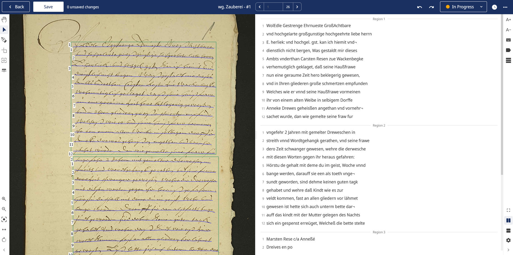
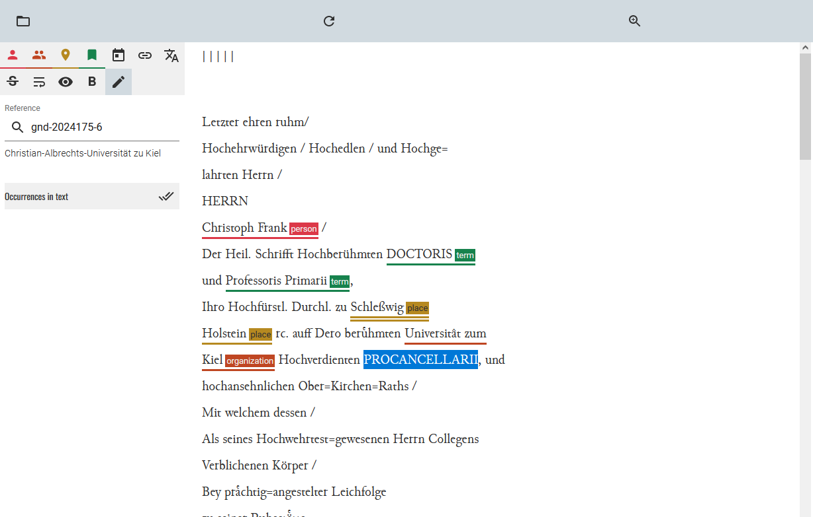

<!--

author: Moritz Riemann, Gregor Große-Bölting
email:  ggb@informatik.uni-kiel.de
version: 0.1
language: en
narrator: UK English Female

-->

# Philosophinnen im Exil III 

**Dozierende:**

* Moritz Riemann (riemann@philsem.uni-kiel.de)
* Gregor Große-Bölting (ggb@informatik.uni-kiel.de)

**Zeit und Raum:** Di 16:15 - 17:45, CAP4 - R.13.1304a

**Thema:**

Nach wie vor finden Philosophinnen in der akademischen Philosophie zu wenig Beachtung. Dies ist auch darauf zurückzuführen, dass viele Philosophinnen des 20. Jahrhunderts unmittelbar von Vertreibung und Verfolgung durch den Nationalsozialismus betroffen waren: Während wenige, wie Hannah Arendt oder Edith Stein, trotz dessen internationale Berühmtheit erlangen konnten, werden einige, wie Judith N. Shklar, erst in den letzten Jahren wiederentdeckt; andere sind fast vergessen (z.B. Margarete Susman, Maria Moll, Gertrud Kantorowicz) oder werden kaum als eigenständige Philosophinnen wahrgenommen (z.B. Lotte Labowsky, Gretel Adorno, Gertrud Bing).

In dieser Seminarreihe begeben wir uns interdisziplinär und mit Methoden der digitalen Geisteswissenschaften auf die Suche nach vergessenen Denkerinnen.
Das Seminar ist teil eines zweijährigen Lehrprojektes schließt an die Veranstaltungen der vergangenen Semester an. Ein Neueinstieg ist jederzeit möglich und sinnvoll. 

**Inhalte und Vorgehen:**

* Interdisziplinäres Arbeiten: Philosophie- und Informatik-studierende arbeiten zusammen und gewinnen Einblick in das andere Fach
* Einblick in die Digital Humanities und grundlegendes Verständnis digitaler Methoden geisteswissenschaftlicher Arbeit
* Arbeit mit X-Technologien, wie XML TEI, ODD, XSLT und RDF
* Praktische Fähigkeiten im Umgang mit Forschungsdaten und im kollaborativen Arbeiten
* Digitale Analyse- und Visualisierungsmethoden für geistes-wissenschaftliche Fragestellungen
* Erforschung angemessener Formen interdisziplinär-digitaler Wissenschaft und Universität
* Reflexion der eigenen Fachkultur und der Methoden der Informatik bzw. Digital Humanities

## Organisatorisches

### Regierungserklärung

1. Diese Veranstaltung ist eine Forschungs**werkstatt**: Wir setzen neue Methoden und Software ein. Seid also nachsichtig mit uns und mit euch selbst, wenn mal etwas nicht funktioniert wie geplant. Lasst uns zeitnah wissen, wenn ihr Probleme habt, dann findet sich für alles eine Lösung!
2. Das Seminar wird sich voraussichtlich für Philosophiestudierende nicht wie eine Philosophieveranstaltung und für Informatikstudierende nicht wie eine Informatikveranstaltung anfühlen.
3. Ihr dürft (und sollt) gerne eigene Tools und Ideen einbringen! Der Seminarplan ist auch offen für Eure Vorschläge.
4. Interdisziplinarität lebt von wechselseitiger Verständlichkeit: Redet mit uns und mit Euren Mitstudierenden, wenn ihr Dinge nicht versteht oder Hilfe braucht.
5. Wir erwarten von euch, dass ihr euch zwischen den Sitzungen mit den Seminarinhalten befasst (Texte lest, Aufgaben erledigt) und zu den Präsenzsitzungen anwesend seid. Im Gegenzug unterstützen wir euch, wo wir können und machen Zugeständnisse, falls die Arbeitsbelastung zu groß werden sollte. 
6. Der Seminarplan ist "im Fluss".

### Semesterplan

| Datum | Thema/Inhalt | Protokoll |
|-------|--------------| --------- |
| 15.04. | Begrüßung, Einführung in das Thema, Überblick über das Semester | - | 
| 22.04. | **I. Philosophiegeschichte.** Judith N. Shklar "Exil, Loyalität, Verpflichtung" | Mika |
| 29.04. | Universität und Philosophie in Deutschland 1920/1930 | Senanur |
| 06.05. | (REFERAT) Sozialgeschichte der Philosophie (bspw. Bourdieu)  |   |
| 13.05. | (REFERAT) Der "Warburg-Kreis": Aby Warburg, Ernst Cassirer, Lotte Labowsky, Getrud Bing |   |
| 20.05. | **II. Digitales Edieren.** Einführung Editionsbegriff, Digitale Edition, Beispiele |   |
| 27.05. | OCR, (semi-)automatische Transkription m. Transkribus und Tesseract |   |
| 03.06. | Einführung in XML und Annotieren mit TEI XML | Peer |
| 10.06. | Auswertungs- und Visualisierungsmöglichkeiten: zeitliche Verläufe, Geo-Daten (GIS), Netzwerkanalysen |   |
| 17.06. | **III. Praxisteil / Projektphase.** Recherchemethoden und Quellen |   |
| 24.06. | (REFERAT) FAIR-Prinzipien und Forschungsdatenmanagment |   |
| 01.07. | (REFERAT) Arbeitssitzung |   |
| 08.07. | *Doppelsitzung:* Abschlusspräsentation | - |

### Forschungs(daten)zyklus

#### ScanTent

#### Transkribus

#### TEI XML: Datenannotation

#### Analyse: Netzwerke, Zeitverläufe, GIS

### Prüfungsleistung

**Für Informatiker_innen:**

* "Sitzungsprotokoll" (15%)
* Peer Review (15%)
* Poster und Posterpräsentation (30%)
* Ausarbeitung (40%)

Alle Teilleistungen müssen für eine erfolgreiche Gesamtteilnahme eingereicht und bestanden werden. 

**Für Philosoph_innen:**

Jede der Prüfungsformen beinhaltet die gemeinsame Präsentation in einer Kleingruppe am Ende des Semesters.

* Referate: bitte frühzeitig melden!
* Podcast (nur für BA7 und BA8)
* Essay
* Hausarbeit

---

Mögliche Referats- und Podcastthemen:

* Sozialgeschichte der Philosophie
* Warburg-Kreis
* Cassirer 
* Porträt: Labowsky, Bing, Klibansky / Verhältnis von Philosophie und Philologie 
* ... sprecht uns an!

#### Hinweise zum "Poster" (für alle)

**Aufgabenstellung:** tba

Das Poster wird in der letzten (Doppel-)Sitzung **am 08. Juli 2025** vorgestellt. Dafür stehen jeder Kleingruppe 10 Minuten zur Verfügung ihre Ergebnisse zu präsentieren. Das Zeitlimit ist strikt.

#### Hinweise zu Podcasts (für Philosoph_innen)

Umfangreiche Hinweise zur Erstellung von Podcasts als Prüfungsleistung findet ihr im [folgenden Leitfaden](https://liascript.github.io/course/?https://raw.githubusercontent.com/mauriemann/Podcast/main/Podcast_main.md).

#### Hinweise zum "Sitzungsprotokoll" (für Informatiker_innen)

**Aufgabenstellung:** Sprecht mit Gregor eine Sitzung ab, für die ihr ein "Sitzungsprotokoll" anfertigt. Das Protokoll soll die wichtigsten Ergebnisse und Erkenntnisse der Sitzung festhalten (nicht den Verlauf) und dient als Ergänzung bzw. Erweiterung des Kursmaterials, sprich: Die "Protokolle" werden direkt in das Material übernommen und dienen als gemeinsame Ressource für alle zur Nachbereitung des Seminars. Entsprechend sollte das Protokoll so aufbereitet sein, dass ein Nicht-Anwesender Studierender sich anhand der Notizen im Nachhinein ein klares Bild davon machen kann, welche Inhalte in der entsprechenden Woche besprochen wurden. 

Das Protokoll muss bis **spätestens zwei Wochen** nach der Sitzung per E-Mail (ggb@informatik.uni-kiel.de) oder [pull request](https://github.com/ggb/Seminar-Philosophinnen-im-Exil) bei mir eingereicht werden.

Weitere Formalia:

* min. 500 Wörter (etwa eine DIN A4-Seite)
* Das Dokument ist in Markdown abgefasst (noch besser: es verwendet die [LiaScript-Syntax](https://liascript.github.io/course/?https://raw.githubusercontent.com/liaScript/docs/master/README.md#1))
* Falls externe Quellen oder Literatur verwendet wurden, müssen diese gemäß eines üblichen Zitationsstandards (APA, IEEE, ACM, etc.) angegeben werden (bevorzugt: APA)
* Falls ChatGPT o. ä. verwendet wurden: Umfang und Prompts angeben 

Für eine ausreichende (oder bessere) Arbeit

* Besitzt der eingereichte Text eine klare Struktur, die durch Markdown kenntlich gemacht wird
* Wurde eine Rechtschreib- und Grammatikprüfung durchgeführt
* Werden die wichtigsten Themen, Begriffe, etc. der Woche aufgeführt

Eine gute (oder bessere) Arbeit

* Ist verständlich geschrieben und besitzt einen deutlichen, roten Faden
* Bezieht die fachliche Expertise Mitstudierender aus der Philosophie mit ein 
* Nennt und verarbeitet Quellen, die über die Seminarliteratur hinausgehen
* Integriert sich nahtlos in das existierende LiaScript-Material für die Sitzung

Das LiaScript-Material findet ihr in diesem GitHub-Repository: https://github.com/ggb/Seminar-Philosophinnen-im-Exil

Um das Material zu erweitern, könnt ihr das Repo forken und entsprechend [dieses Workflows](https://github.com/ggb/Seminar-Philosophinnen-im-Exil) eine Pull Request stellen.

#### Hinweise zur Peer Review (für Informatiker_innen)

**Aufgabenstellung:** Euch wird am Tag der Posterpräsentation eine andere Gruppe zugewiesen. Schreibt eine kurze "Kritik" des vorgestellten Posters. Diese Kritik sollte in der Tendenz positiv, wertschätzend und konstruktiv sein, d.h. Möglichkeiten der Verbesserung aufzeigen. Versucht dafür nachvollziehbare Kriterien der Bewertung zu finden. Berücksichtigt sowohl den Vortrag, wie auch das erstellte "Poster". Die Peer Review sollte die Möglichkeit bieten die kritisierten Punkte in der Ausarbeitung zu berücksichtigen.

Das Protokoll ist **bis spätestens zum 31. Juli 2025** per E-Mail (ggb@informatik.uni-kiel.de) bei mir als PDF einzureichen.

Weitere Formalia:

* 300 Wörter (+/- 20%), etwas weniger als eine DIN A4-Seite. Bitte gebt die Anzahl der Wörter am Ende des Dokuments an.
* Name, stu-Mailadresse
* Unterschriebene Eigenständigkeitserklärung
* Falls externe Quellen oder Literatur verwendet wurden, müssen diese gemäß eines üblichen Zitationsstandards (APA, IEEE, ACM, etc.) angegeben werden
* Falls ChatGPT o. ä. verwendet wurden: Umfang und Prompts angeben (ich rate von der Verwendung ab, da es sich um eine Reflexion der eigenen Erfahrungen mit dem Tool handeln soll)

Für eine ausreichende (oder bessere) Arbeit

* Besitzt der eingereichte Text eine klare Struktur
* Wurde eine Rechtschreib- und Grammatikprüfung durchgeführt
* Der Text wertschätzend und konstruktiv verfasst
* Ein "problematischer" Aspekt der Posterpräsentation identifziert

Eine gute (oder bessere) Arbeit

* Ist verständlich geschrieben und besitzt einen deutlichen, roten Faden
* Mehrere verbesserungswürdie Aspekte der Posterpräsentation identiziert
* Lösungsmöglichkeiten für die Aspekte benannt

#### Hinweise zur Ausarbeitung (für Informatiker_innen)

**Aufgabenstellung:** tba

Die Ausarbeitung sollte eine Einleitung mit Motivation, eine Darstellung des Hintergrunds und Forschungskontexts, eine Vorstellung und Begründung der Methodik, die Ergebnisse und Diskussion eurer Untersuchung, sowie einen kurzen Abschluss und Ausblick beinhalten. Eure Untersuchung und Ausarbeitung dürfen alle Materialien, die ihr im Laufe des Semesters erarbeitet hat, benutzen. Ihr könnt bspw. eure Zwischen- oder Abschlusspräsentation als Grundlage verwenden. 

Sprecht bis zum **31. Juli 2025** ein Thema mit mir (Gregor) per E-Mail, Mattermost oder in einer Sprechstunde (Termin auf Anfrage) ab.

Die Ausarbeitung muss bis zum **30. September 2025** (Ende des Semesters) per E-Mail (ggb@informatik.uni-kiel.de) bei mir als PDF eingereicht werden.

Weitere Formalia:

* 1500 Wörter im einspaltigen [ACM-Template](https://www.acm.org/publications/proceedings-template), bevorzugt in LaTeX ([Overleaf](https://www.rz.uni-kiel.de/de/angebote/software/overleaf/overleaf))
* Name, stu-Mailadresse
* Unterschriebene Eigenständigkeitserklärung
* Externe Quellen sind gemäß der ACM-Zitierweise anzugeben; das Literaturverzeichnis zählt nicht zur Gesamtlänge
* Falls ChatGPT o. ä. verwendet wurden: Umfang und Prompts angeben (zählt nicht zur Gesamtlänge)
* Die Arbeit kann auf Deutsch oder Englisch verfasst werden

Für eine ausreichende (oder bessere) Arbeit

* Besitzt der eingereichte Text eine klare Struktur
* Ist verständlich geschrieben und besitzt einen deutlichen, roten Faden
* Wurde eine Rechtschreib- und Grammatikprüfung durchgeführt
* Baut auf den Diskussionen und Ergebnissen des Seminars und/oder der Posterpräsentation auf
* Reflektiert das eigene Vorgehen und zeigt Vor- und Nachteile auf

Eine gute (oder bessere) Arbeit

* Leistet einen Beitrag, der erkennbar über die Ergebnisse des Seminars und/oder der Posterpräsentation hinausgeht
* Bezieht Literatur ein, die über das hinausgeht, was im Seminar erwähnt/verwendet wurde
* Zeigt ein hohes und kritisches Verständnis der vewendeten Methoden
* Reflektiert den informatischen und philosophischen (natürlich weniger umfangreich) Beitrag für die Digital Humanities

## Sitzung am 15.04. 

### "Speed Dating"

Sprecht mit der Person, die euch gegenübersitzt, zwei Minuten über die folgenden Fragen:

1. Warum studiert Ihr Eure Disziplin?
2. Was bewundert Ihr an der jeweils anderen Disziplin?
3. Welche einflussreichen Frauen (Philosophinnen, Informatikerinnen) kennt ihr in eurer Disziplin?

Wenn das Signal gegeben wird, rücken diejenigen, die mit dem Rücken zum Eingang/Front sitzen, einen Platz nach links.

Diejenigen die außen sitzen wechseln die Reihe und füllen den leeren Platz in der nächsten Reihe auf usw.

### Wie liest man philosophische Texte?

Philosophische Texte sollten bzw. können nicht wie andere Texte gelesen werden: Sie müssen eingeordnet und verstanden werden, das Textverständnis erfordert eine aktive Auseinandersetzung. Rosenberg (1984) macht sechs verschiedene Vorschläge, wie man eine:n Philosoph:in lesen kann:

>1. Sie können einen Philosophen auf seine Resultate hin lesen 
>2. Sie können einen Philosophen auf seine Argumente hin lesen 
>3. Sie können einen Philosophen in seinem dialektischen Zusammenhang lesen 
>4. Sie können einen Philosophen kritisch lesen
>5. Sie können einen Philosophen auf die Entscheidung eines Problems hin lesen
>6. Sie können einen Philosophen kreativ lesen 
>
> (Rosenberg, 1984)

Der vollständige Text mit einer Erläuterung, was es mit den einzelnen Thesen auf sich hat, findet sich im [OLAT-Materialverzeichnis](https://lms.uni-kiel.de/url/RepositoryEntry/5455183961/CourseNode/109271451133388/path%3D~~Texte~~Jay%20F%2E%20Rosenberg%5F%20Sechs%20Moglichkeiten%5F%20einen%20Text%20zu%20lesen%2Epdf/0). 

### Zur nächsten Sitzung

Lest zur folgenden Sitzung (im OLAT Materialverzeichnis zu finden):

* Shklar, J. N. (2019). *Verpflichtung, Loyalität, Exil* (H. Bajohr, Ed.; No. 130; Erste Auflage). Matthes & Seitz Berlin.

Lest den Text aufmerksam auf folgende Fragen hin:

1. Warum spricht Shklar von Exil und nicht von Flucht oder Migration?
2. In welchem Verhältnis stehen Verpflichtung und Loyalität zueinander? Was bedeuten die Begriffe bei Shklar?
3. Was hat es mit dem Verrat eines Staats an seinen Bürger:innen auf sich?
4. Warum muss Loyalität gebändigt werden und was ist Shklars Lösung dafür?

## Sitzung am 22.04.

### Judith Nisse Shklar

**Name:** Judith Nisse Shklar  

**Geboren:** 24. September 1928 in Riga, Lettland 

**Gestorben:** 17. September 1992 in Cambridge, Massachusetts, USA  

**Beruf:** Politikwissenschaftlerin und politische Theoretikerin  

Judith Shklar gilt als eine der bedeutendsten liberalen Theoretikerinnen des 20. Jahrhunderts. Ihre Arbeiten haben bis heute Einfluss auf Debatten über politische Ethik, Machtbegrenzung und die Rolle von Freiheit in einer liberalen Gesellschaft.

#### Leben

**Herkunft und Flucht:** 
Geboren in eine deutschsprachige jüdische Familie, floh sie 1939 mit ihrer Familie vor den Nationalsozialisten und Sowjets über die Transsibirische Eisenbahn nach Kanada.  

**Bildung:** 
Studium der Politikwissenschaft an der McGill University in Montreal; Promotion an der Harvard University (1955). 

**Karriere:**
Erste Frau auf einer Festanstellung im Fachbereich Politische Wissenschaften an der Harvard University. Sie lehrte dort bis zu ihrem Tod und wurde 1980 zur "John Cowles Professor of Goverment" ernannt.

[**Storymap zu Shklars Flucht und Vita**](https://storymaps.arcgis.com/stories/38af7d5862a84180a00f70f34981df5b)

(Elaine Ringeloth, Fleming Jensen, SoSe 2024)

#### Philosophisches Denken

**Wichtige Werke**:

- *After Utopia: The Decline of Political Faith* (1957)  
- *Ordinary Vices* (*Ganz normale Laster*, 1984)  
- *The Liberalism of Fear* (*Der Liberalismus der Furcht*, 1989)  
- *Faces of Injustice* (*Über Ungerechtigkeit*, 1990)

**Der Liberalismus der Furcht (1989)**
Dieser kurze Text ist ihr bekanntester und prägendster. Es formuliert eine liberale Theorie, die darauf abzielt, Grausamkeit und Machtmissbrauch zu verhindern. Shklar argumentiert, dass der Liberalismus vor allem die Freiheit sichern sollte, ohne Furcht Entscheidungen treffen zu können. Sie befürwortet eine konstitutionelle, repräsentative und menschenrechtlich-liberale Demokratie, die Macht begrenzt und verteilt.

**Ganz normale Laster (1984)**

In diesem Buch untersucht Shklar alltägliche moralische Schwächen wie Grausamkeit, Heuchelei und Feigheit. Sie stellt Grausamkeit als das größte Übel (*summum malum*) dar und verbindet dies mit ihrer liberalen Theorie. Das Werk bietet eine tiefgehende Reflexion über die moralischen Grundlagen des politischen Handelns.

**Über Ungerechtigkeit (1990)**

In diesem Werk kritisiert Shklar die philosophische Vernachlässigung des Konzepts der Ungerechtigkeit zugunsten von Gerechtigkeitstheorien. Sie analysiert verschiedene Formen von Ungerechtigkeit (z. B. passive und aktive Ungerechtigkeit) und betont deren zentrale Bedeutung für politische und soziale Theorie.

**After Utopia: The Decline of Political Faith (1957)**

Dieses frühe Werk kritisiert utopisches Denken in der politischen Theorie und plädiert für eine realistische Betrachtung politischer Möglichkeiten. Es zeigt Shklars Skepsis gegenüber Ideologien, die auf idealisierten Zukunftsvisionen basieren.

**Essays über Hannah Arendt**

Ihre kritischen Texte über Hannah Arendt beleuchten Unterschiede in den Denkansätzen der beiden Philosophinnen, insbesondere in Bezug auf Exil, Freiheit und politische Romantik. Diese Essays sind besonders relevant für das Verständnis von Shklars Position im Vergleich zu anderen großen politischen Theoretikern[2].
Diese Werke prägen bis heute Debatten über Liberalismus, Gerechtigkeit und politische Ethik und machen Judith Shklar zu einer der bedeutendsten Denkerinnen des 20. Jahrhunderts.

#### Verpflichtung, Loyalität, Exil

1. Warum spricht Shklar von Exil und nicht von Flucht oder Migration?
2. In welchem Verhältnis stehen Verpflichtung und Loyalität zueinander? Was bedeuten die Begriffe bei Shklar?
3. Was hat es mit dem Verrat eines Staats an seinen Bürger:innen auf sich?
4. Warum muss Loyalität gebändigt werden und was ist Shklars Lösung dafür?

>**Think. Pair. Share.** Jede Person geht 5 Minuten ihre Lektürenotizen durch. Danach besprecht Ihr Euch bitte zu zweit 10 Minuten lang über Eure Erkenntnisse und die Lektürefragen. Anschließend Diskussion im Plenum.

### Zur nächsten Sitzung 

Lest zur folgenden Sitzung: 

* Eilenberger, W. (2021). Zeit der Zauberer (Elfte Auflage). Klett-Cotta. S. 13 -- 42 (im OLAT)
* Grüttner, M. (2021). The Expulsion of Academic Teaching Staff from German Universities, 1933–45. Journal of Contemporary History, 57(3), 513–533. https://doi.org/10.1177/00220094211063074 (frei verfügbar, hier: https://api-depositonce.tu-berlin.de/server/api/core/bitstreams/8d843318-c8d0-4f11-9b01-0c1b06689006/content)
