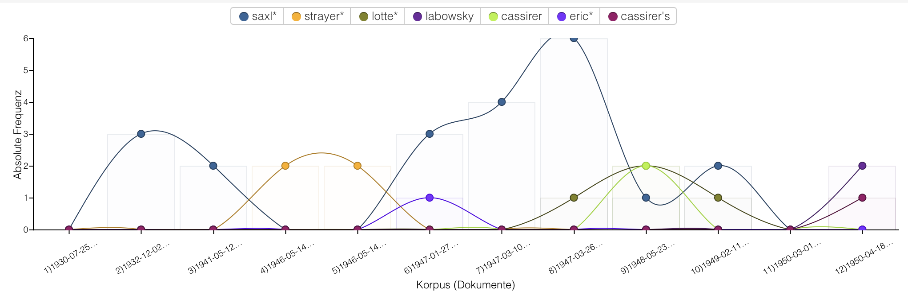

# Digital Humanities: Wie gut können Daten Kontext?
------------------------------------
### Fragestellung

<!-- Alternative Formulierung: Lotte Labowsky und Gertrud Bing hatten beide ein sehr unterschiedliches Verhältnis zu Raymond Klibansky, obgleich sie in den vorliegenden Briefen beide im Arbeitskontext mit ihm kommunizierten. Inwiefern lässt sich dies durch eine Analyse der Daten zeigen und bestätigen, wo ist eine emotional-kontextuelle Analyse notwendig? -A --> 

* Wie unterscheiden sich die Briefe zwischen Klibansky-Bing und Klibansky-Labowsky jeweils? Wie viel Arbeitskontext ist jeweils erhalten? Welche Unterschiede lassen sich analytisch herausstellen, wo bedarf es einer "emotional-kontextuellen" Analyse? 
------------------------------------
### Vorgehen
* Analyse des gesamten Textkorpus' mit Voyant sowie Graphenerstellung anhand von Python
* Differenzierte Betrachtung der beiden Personenkonstellationen
------------------------------------
### Hinweise zu den Graphen
* Bing, Klibansky, Labowsky jeweils rot markiert
* Personen, welche bei einem (oder mehreren) der Arbeitgeber aus folgender Liste gearbeitet haben, wurden grün markiert:  `'Kulturwissenschaftliche Bibliothek Warburg', 'University of London', 'Warburg Institute'`
* Die Knoten von Personen, deren Geburtsdatum vor 1860 war, wurden ein wenig heller dargestellt
* Die Knoten von Personen, die in den Jahren 1930-1950 (Zeitraum der Briefe in dieser Analyse) verstorben sind, wurden dunkler markiert
* Personen, zu denen es keinen Eintrag in Wikidata gab, wurden grau markiert
* Titel der Knoten ist der Name aus Wikidata, falls vorhanden, sowie Geburts- und Todesjahr
    * ansonsten die Auflistung aller annotierten Begriffe zu dieser Person
* [Verweis zum Jupyter-Notebook](./code/group1_network.ipynb)

------------------------------------

### Bing-Klibansky

#### Analytisch

#### Emotional-kontextuell
* Überwiegend geschäftlich/fachliche Inhalte, fachlich sehr in die Tiefe gehend
    * zeigt, dass Klibansky Bing fachlich vertraut
    * Klibansky fragt Bing nach ihrer Meinung
    * Klibansky bezieht Bing aktiv in Entscheidungen mit ein 
    * Wirkung wie Zusammenarbeit statt autoritärem Arbeitsverhältnis (bsp. Klibansky-Bing 1949-02-11 "I hope you will be pleased by this development.", "This is a minor matter, but it will have to be decided soon. At present, it will be easier for **us**, presumably, to spare a set of the German proofs[...]")
* Hohe Informationsdichte --> Schlussfolgerung: Bing und Klibansky kennen sich gut

##### Bezug auf Datenvisualisierung
* Was ist sichtbar?
    * Bing und Klibansky unterhalten sich vor allem über Fritz Saxl, aber auch (in vgl. zu Labowsky) über Aby Warburg, Ernst Cassirer etc. (Menschen, die für das Warburg-Institut sehr relevant sind)
* Bezug auf Kontext
    * Thematischer Kontext der Briefe häufig auch auf Warburg-Institut und fachliche Inhalte bezogen
    * Wenig privates 

------------------------------------
### Labowsky-Klibansky

#### Analytisch

#### Emotional-kontextuell
   * Zu großen Teilen private Inhalte - innige Beziehung zwischen Labowsky und Klibansky wird deutlich
   * Bezug auf Arbeit am Institut häufig koordinierend
##### Bezug auf Datenvisualisierung
* Was ist sichtbar?
    * Im Vergleich zum anderen Graphen gibt es keine einzelnen Knoten, die ganz so stark herausstechen
    * Arbeitskontext meist nur in Verbindung mit der Nennung von Gertrud Bing
    * H.A.R. Gibb nimmt viel Raum ein - welche Verbindung zum Institut?
* Bezug auf Kontext
    * Persönliches Befinden und anekdotische Einzelheiten aus Arbeitsgesprächen sind häufige Themen
    * Ab 1947 zunehmend Absprache bezüglich Platon-Edition aufgrund Klibanskys Aufenthalt in Montreal

------------------------------
### Analyse mit Voyant

Häufigkeit personeller Nennungen in den Briefen:
* X-Achse: Chronologische Reihenfolge der Briefe
* Y-Achse: Absolute Häufigkeit der Namensnennungen.

#### Bing-Klibansky

* Fritz Saxl am häufigsten erwähnt, mit mehreren deutlichen Peaks, besonders um 1932 und 1947–1948
* Strayer wird fast ausschließlich 1946 erwähnt
* Eric Warburg zeigt zwei kleinere Peaks – einen um 1947 und einen stärkeren 1950, späte, aber zunehmende Bedeutung
* Cassirer und Lotte Labowsky treten erst ab 1947/1948 in Erscheinung,

--------------------------------------
 #### Labowsky-Klibansky
 
 

* Vor 1946 kaum Namensnennungen
* Deutliche Häufung der Erwähnungen in den Jahren 1948–1949.
* Gibb hat eine deutliche Häufung um Mai 1948 (Höchstwert: 13 Nennungen).
* Bing, Walzer und Saxl zeigen zwischen Mai und Oktober 1948 eine erhöhte Häufigkeit